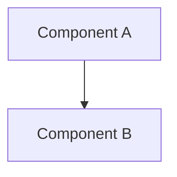
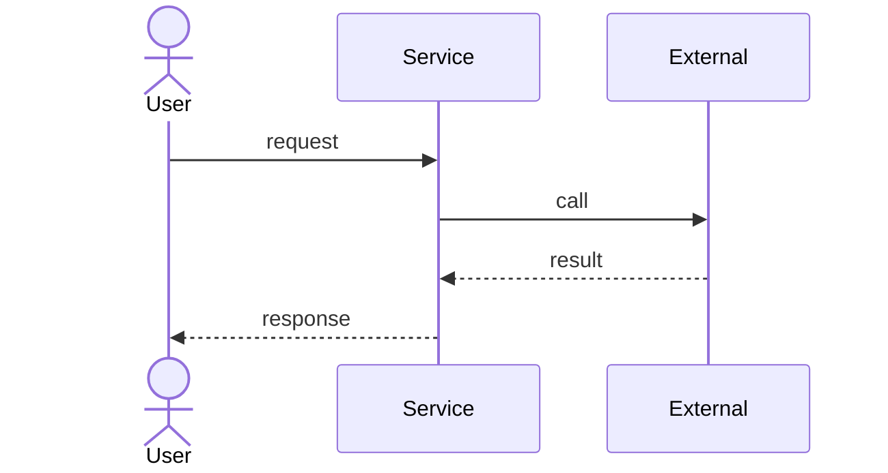

# Design Doc Template

コピー先: `docs/design/epic-NN-<topic>.md`。
`NN` は Epic Issue ID とは独立のゼロ詰め連番（`01`, `02`, …）。

---

# Epic NN: <Title>

## Acceptance Criteria

Epic Issue body から転記する。

- [ ] AC 1
- [ ] AC 2

## Glossary

| Term | Meaning |
|---|---|
| <略語 or ドメイン用語> | <説明; 本文で略語を単独参照しない> |

## Scope

この Epic が [docs/PRD.md](../../docs/PRD.md) のどの要件と
[docs/ARCHITECTURE.md](../../docs/ARCHITECTURE.md) のどのコンポーネントを前進させるかを示す。

- **Epic 範囲内**: <…>
- **Epic 範囲外**: <…（どの Epic に委ねるか）>

## Architecture

mermaid の `flowchart` / `graph` で構成図を描く（ASCII 図は不可。GitHub が描画する）。
既存の関数・ファイルはパスで参照する。

## Module Responsibilities

各モジュール/関数の「責務（する）」と「境界（しない・どこへ委譲するか）」を**表形式**で示す
（箇条書き不可）。境界列で「ここから先は他のどのモジュールの領分か」が読み取れるようにする。
他 Epic / 既存モジュールの領分は「（他 Epic 領分）」等と明記して行に含めてよい。

| モジュール / 関数 | 責務（する） | 境界（しない → 委譲先） |
|---|---|---|
| `<path>::<function>` | <このモジュールがすること> | <しないこと → 委譲先モジュール> |

## Sequence Diagram

mermaid の `sequenceDiagram` で、ユーザ／クラス／外部境界（ファイルシステム・ネットワーク・
外部API）のインタラクションを可視化する。誰がどの順で何を呼び、どう応答するかを表す。
図で表せない補足（境界の説明など）は図の下に短く添える。

## Data Model

| Field | Type | Purpose | Example |
|---|---|---|---|
| ... | ... | ... | ... |

## Decisions

このセクションは **Epic-scoped** な決定のみ置く（効果がこの Epic を超えないもの）。
cross-epic な決定（長期制約・アーキテクチャ変更・ライブラリ選定・公開API契約変更・
AC再解釈）は `docs/adr/` の ADR に置く。
[.claude/rules/adr-template.md](adr-template.md) と CLAUDE.md の ADR ハードルールを参照。

### Decision: <kebab-case-slug>

- **What**: <決定>
- **Why**: <動機>
- **Affected modules**: <一覧>
- **Alternatives considered**: <一覧と簡潔な理由>
- **Consequences**: <正負の含意>

### Cross-epic decisions (links to ADR)

- [ADR-NNNN: <title>](../adr/NNNN-<slug>.md) — 一行サマリ

## Test Design Matrix

| Story \ Layer | Unit | Integration | E2E |
|---|---|---|---|
| Story N.M | ☐ | ☐ | ☐ |

完了時に ✓ を付ける。このマトリクスが Epic PR のレビューゲート。

## Story Timeline

Story 完了とキーイベントの追記専用ログ。

- YYYY-MM-DD — Story N.M completed: <一行サマリ>
