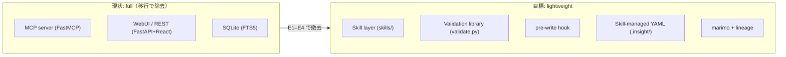
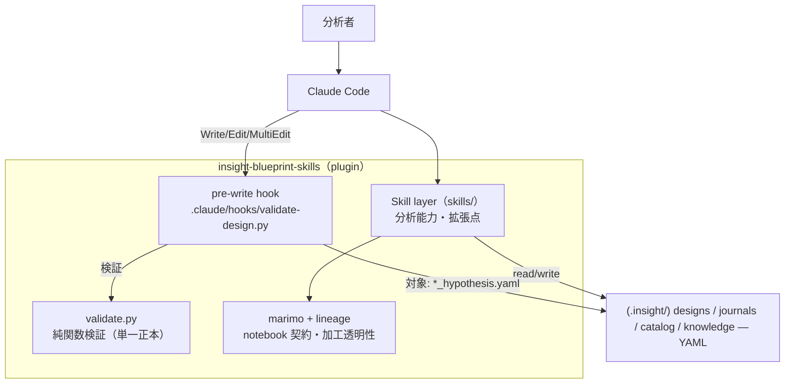
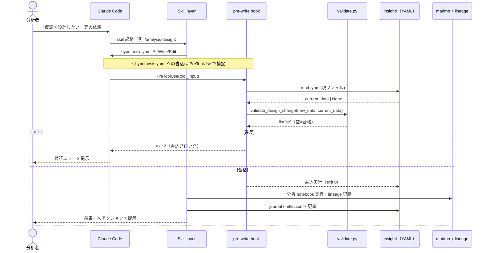

# ARCHITECTURE: insight-blueprint-skills

本書は軽量版（target state）アーキテクチャの**正本**。CLAUDE.md §2 は要約とポインタのみを置く。
プロダクト要件は [PRD.md](PRD.md)、個別決定は [docs/adr/](adr/) を参照。

**移行中**: MCPサーバ / WebUI / SQLite はまだツリーに残り、Epic E1–E4 で段階的に除去される
（[ADR-0001](adr/0001-drop-mcp-server-embed-validation.md)）。本書は移行の到達点を示す。

## 不変条件（invariants）

- **No daemon / No MCP server / No SQLite**。常駐プロセスを持たない。
- 検証はプロセスではなく**ライブラリ**として埋め込む（SQLite と同じ転換）。
- 設計書整合性の**正本は `validate.py` の1箇所**。hook と skill の双方が再利用する。
- リリースは **tag 駆動**（`publish.yml` は `v*` タグで発火）。main マージ＝publish ではない。

## 現状 → 目標

## コンポーネントと責務

- **Skill layer（`skills/`）** — すべての分析能力。拡張点。設計書・journal・catalog 等の YAML を直接 read/write する。
- **Validation library（`src/insight_blueprint/validate.py`）** — I/O を持たない純関数。
  Pydantic スキーマ検証（`AnalysisDesign`）+ 状態遷移ガード（`VALID_TRANSITIONS`）。設計書整合性の単一正本。
- **pre-write hook（`.claude/hooks/validate-design.py`）** — `.insight/designs/*_hypothesis.yaml` への
  Write/Edit/MultiEdit を `validate.py` で検証し、違反を `exit 2` でブロックする I/O 殻。
- **Skill-managed YAML（`.insight/`）** — designs / journals / catalog / knowledge。skill が直接管理する。
- **marimo + lineage（`src/insight_blueprint/lineage/`, `_templates/`）** — notebook 契約と加工の透明性・追跡。

## 代表シーケンス（分析ワークフロー）

分析者とモジュールの時系列インタラクション。仮説設計 → 検証ガード → 分析 → 記録の代表フローを示す
（個別 Epic の詳細シーケンスは各 Epic Design Doc 側）。

## Epic マッピング

| Epic | 主に触るコンポーネント |
|---|---|
| E1 | WebUI/REST（撤去）— full の縮小 |
| E2 | Validation library + pre-write hook（新設） |
| E3 | Skill layer ↔ Skill-managed YAML（設計書ライフサイクルの直接 I/O 化、design_io） |
| E3.5 | catalog / premortem / lineage の MCP→YAML 変換 + batch-analysis 撤去（E4 前提） |
| E4 | MCP server（撤去） |
| E5 | catalog（柔軟化）/ premortem（自立化） |

## 参照

- [ADR-0001](adr/0001-drop-mcp-server-embed-validation.md) — MCPサーバ廃止・検証の埋め込み化
- [ADR-0002](adr/0002-trunk-based-epic-stacking.md) — トランクベース + stacked Epic
