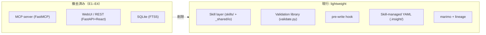
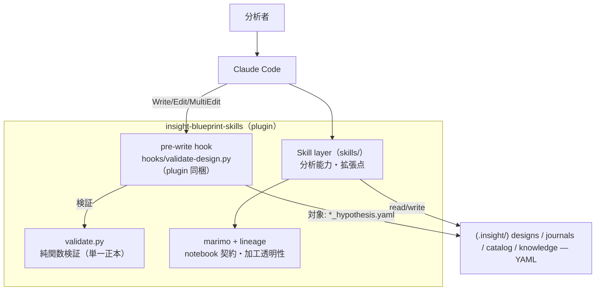
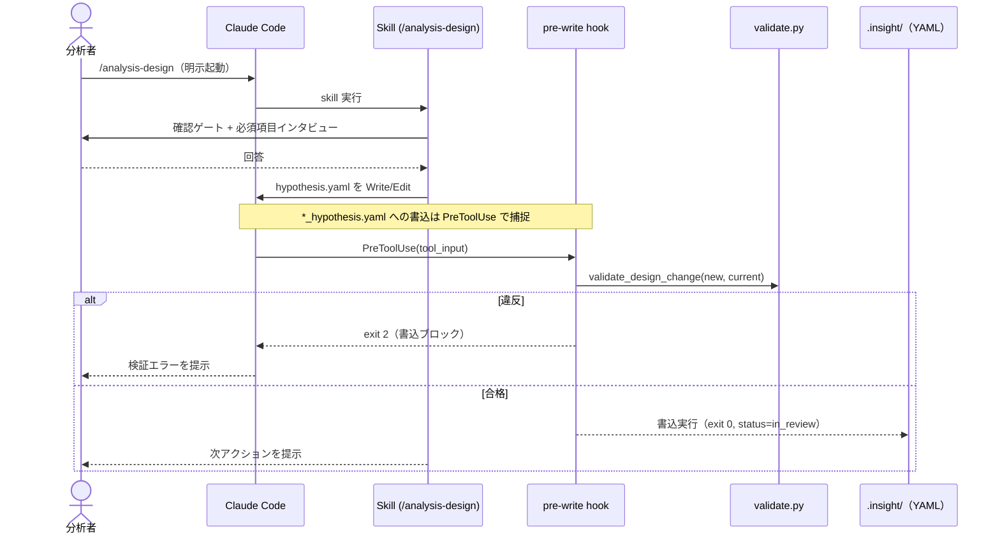
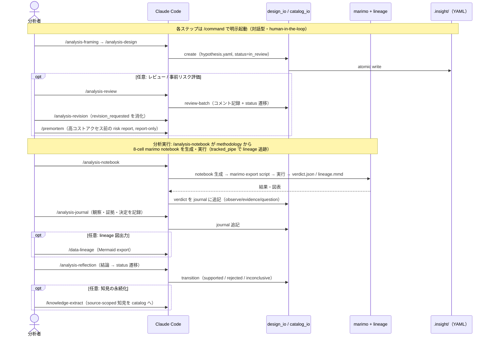
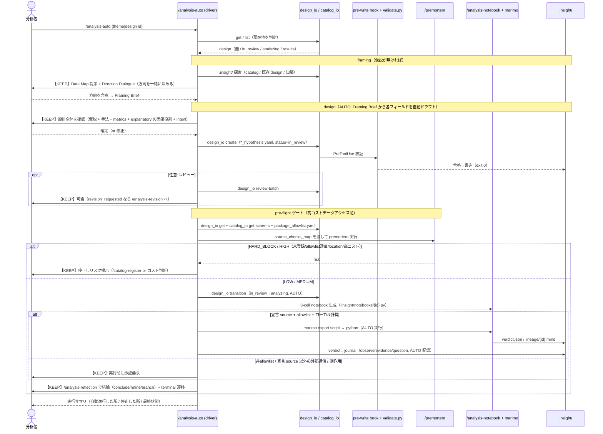

# ARCHITECTURE: insight-blueprint-skills

本書は軽量版（target state）アーキテクチャの**正本**。CLAUDE.md §2 は要約とポインタのみを置く。
プロダクト要件は [PRD.md](PRD.md)、個別決定は [docs/adr/](adr/) を参照。

**移行状況**: MCPサーバ / WebUI / SQLite は E1–E4 で除去済み
（[ADR-0001](adr/0001-drop-mcp-server-embed-validation.md)）。本書は現行アーキテクチャを表す。
E5 で解体計画は完結: premortem 自立化（E5a, report-only 化）/ knowledge 抽出強化（E5b,
Claude-native + source-scoped）/ catalog 柔軟化（E5c, open string taxonomy, [ADR-0004](adr/0004-open-string-catalog-taxonomy.md)）。

## 不変条件（invariants）

- **No daemon / No MCP server / No SQLite**。常駐プロセスを持たない。
- 検証はプロセスではなく**ライブラリ**として埋め込む（SQLite と同じ転換）。
- 設計書整合性の**正本は `validate.py` の1箇所**。hook と skill の双方が再利用する。
- リリースは **tag 駆動**（`publish.yml` は `v*` タグで発火）。main マージ＝publish ではない。

## 構成（E1–E4 完了後）

full（MCP server / WebUI / SQLite）は撤去済み。現行は軽量版のみ。

## コンポーネントと責務

- **Skill layer（`skills/`）** — すべての分析能力。拡張点。設計書・journal・catalog 等の YAML を直接 read/write する。
- **Validation library（`src/insight_blueprint/validate.py`）** — I/O を持たない純関数。
  Pydantic スキーマ検証（`AnalysisDesign`）+ 状態遷移ガード（`VALID_TRANSITIONS`）。設計書整合性の単一正本。
- **pre-write hook（`hooks/validate-design.py`, plugin 同梱 `hooks/hooks.json`）** —
  `.insight/designs/*_hypothesis.yaml` への Write/Edit/MultiEdit を plugin の uv 環境で `validate.py`
  にかけ、違反を `exit 2` でブロックする I/O 殻。利用者の install 先プロジェクトでも効く
  （この repo の `.claude/settings.json` は dev 用に同スクリプトを配線）。
- **Skill-managed YAML（`.insight/`）** — designs / journals / catalog / knowledge。skill が直接管理する。
- **marimo + lineage（`src/insight_blueprint/lineage/`）** — 分析 notebook は同梱テンプレートでなく、
  **`/analysis-notebook` skill が設計書の `methodology` から 8-cell 契約に沿って生成・実行**する
  （`skills/analysis-notebook/references/notebook-contract.md`）。`lineage`（`tracked_pipe` / Mermaid export）は
  optional な `insight-blueprint-lineage[notebook]` パッケージで、notebook 内の加工を追跡・可視化する。

### Skill invocation model

**既定は明示・対話型**: 全 skill は frontmatter で `disable-model-invocation: true`（明示 `/command` 起動）
であり、各ステップはユーザーが明示的に起動する。無人バッチ実行は batch-analysis の役割で E3.5 で意図的に撤去された。

**selective autonomy（`/analysis-auto`）**: driver スキル `/analysis-auto` を起動したときに限り、Claude が
既存 skill を順に駆動し、**本物の判断（KEEP ゲート）でだけ停止**する guided autopilot になる。invocation フラグは
大域変更しない（自律性はこの run に限定）。KEEP ゲート = 仮説確定 / データソース登録 / premortem `HARD_BLOCK`・`HIGH` /
notebook の非 allowlist・宣言 source 以外の外部通信 / 結論。notebook の auto 実行は premortem 通過 + allowlist +
宣言 source 限定のときのみ。詳細は [ADR-0005](adr/0005-selective-autonomous-chaining.md)。**「auto mode」は無人ではなく
guided autopilot**（対話型・オプトイン）である。

## 代表シーケンス

### 設計書の書込と検証ガード

`*_hypothesis.yaml` を書くときの検証フロー。skill は `/command` で明示起動され、書込は
pre-write hook が捕捉して検証する。

### 分析ワークフロー全体（対話型・明示起動）

end-to-end の代表フロー。既定では**各 `/skill` はユーザーが明示的に起動する**が、`/analysis-auto`
（guided autopilot）を使うと driver がこの同じ経路を駆動し KEEP ゲートでだけ停止する（上記 «Skill invocation model» /
[ADR-0005](adr/0005-selective-autonomous-chaining.md)）。**notebook の生成・実行は `/analysis-notebook` が design の
`methodology` から 8-cell 契約に沿って行う**（`skills/analysis-notebook/references/notebook-contract.md`）。
`/analysis-review`・`/premortem`・`/data-lineage` は任意ステップ。

### guided autopilot（`/analysis-auto`）の詳細シーケンス

初学者が最初に使う想定の入口。driver `/analysis-auto` が各 skill を駆動し、**KEEP ゲート**（太字の
`U に確認`）でだけ停止する。個々の skill・CLI・premortem・notebook 実行との詳細インタラクションを示す
（[ADR-0005](adr/0005-selective-autonomous-chaining.md)）。

## Epic マッピング

| Epic | 主に触るコンポーネント |
|---|---|
| E1 | WebUI/REST（撤去）— full の縮小 |
| E2 | Validation library + pre-write hook（新設） |
| E3 | Skill layer ↔ Skill-managed YAML（設計書ライフサイクルの直接 I/O 化、design_io） |
| E3.5 | catalog / premortem / lineage の MCP→YAML 変換 + batch-analysis 撤去（E4 前提） |
| E4 | MCP server（撤去） |
| E5a | premortem（report-only 自立化） |
| E5b | catalog_io（knowledge write/upsert）+ /knowledge-extract（Claude-native 抽出） |
| E5c | models.catalog（open string taxonomy + extra=allow）+ 2 skill 汎用化 |

## 参照

- [ADR-0001](adr/0001-drop-mcp-server-embed-validation.md) — MCPサーバ廃止・検証の埋め込み化
- [ADR-0002](adr/0002-trunk-based-epic-stacking.md) — トランクベース + stacked Epic
- [ADR-0003](adr/0003-skill-yaml-io-via-design-io.md) — skill の設計書 I/O を design_io に集約
- [ADR-0004](adr/0004-open-string-catalog-taxonomy.md) — catalog の taxonomy を open string に
