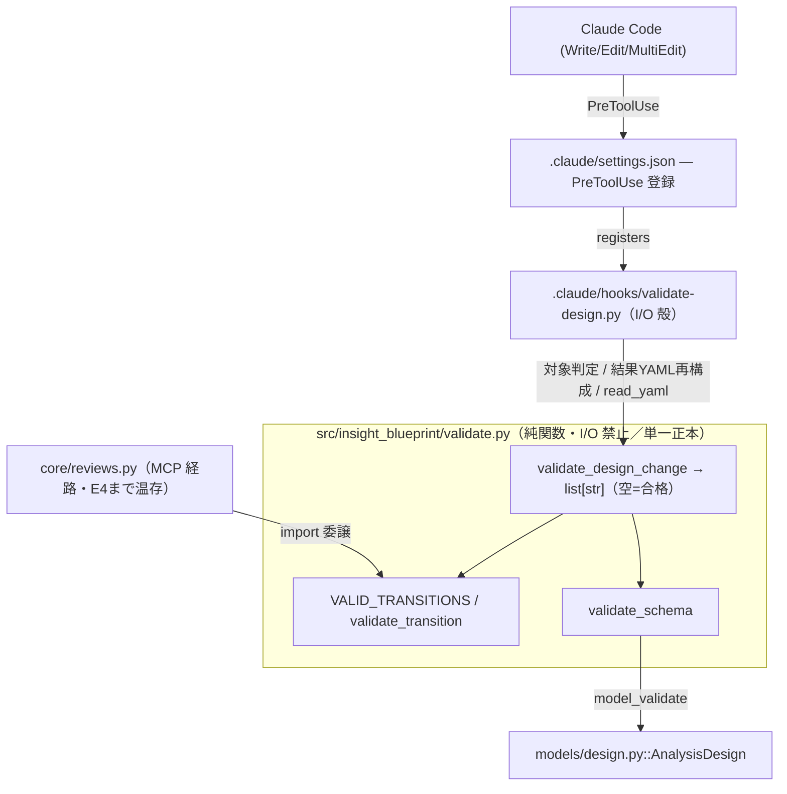
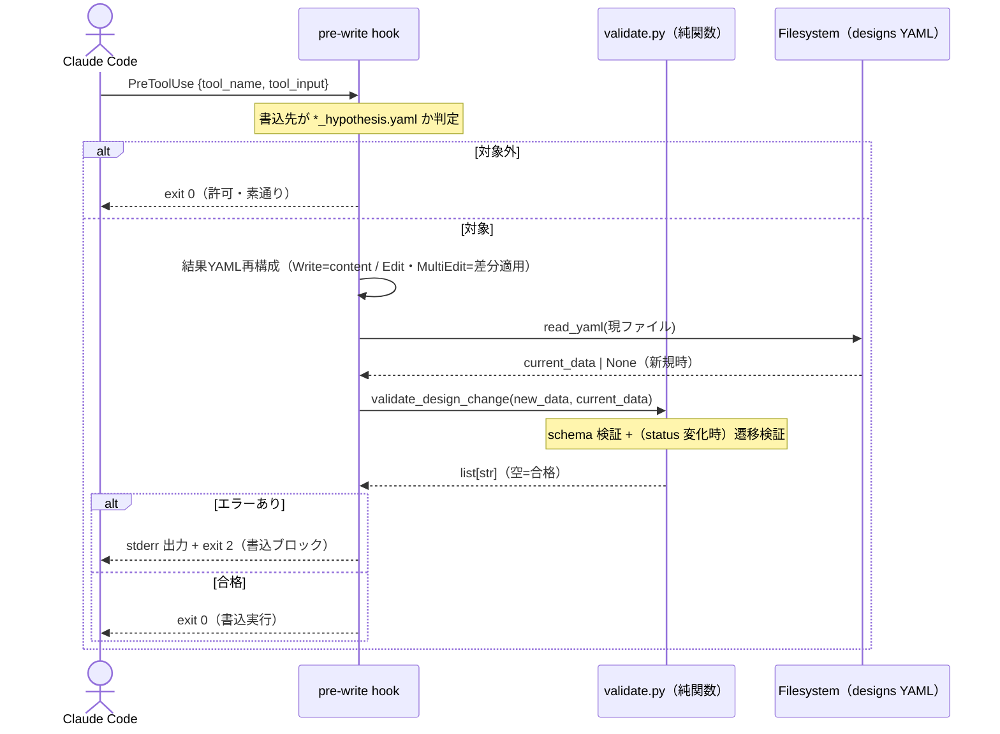

# Epic 02: validate.py 抽出 + pre-write hook 新設

/ ADR-0001 の解体ロードマップ E2。MCPサーバが手放せない理由だった検証ロジックを
純関数ライブラリに集約し、pre-write hook で強制する。MCPサーバ本体は E4 まで温存。

## Acceptance Criteria

- [x] AC1: `src/insight_blueprint/validate.py` が新設され、`VALID_TRANSITIONS`・状態遷移検証・
  `AnalysisDesign` スキーマ検証を純関数（I/O なし）として提供する
- [x] AC2: `core/reviews.py` が `VALID_TRANSITIONS`/`_validate_transition` を validate.py へ委譲し、
  MCP tool 群の挙動が不変（`pytest` 全緑、既存テストを割らない）
- [x] AC3: `.claude/hooks/validate-design.py` が `.insight/designs/*_hypothesis.yaml` への
  Write/Edit/MultiEdit をインターセプトし、スキーマ違反・不正遷移を `exit 2` でブロックする
- [x] AC4: `.claude/settings.json`（tracked）に PreToolUse hook が登録される
- [x] AC5: validate.py の単体テストと hook の統合テストが追加され、全緑

## Glossary

| Term | Meaning |
|---|---|
| validate.py | `src/insight_blueprint/validate.py`。設計書検証の単一正本となる純関数ライブラリ |
| pre-write hook | `.claude/hooks/validate-design.py`。Claude Code の PreToolUse hook |
| 状態遷移ガード | `VALID_TRANSITIONS` に基づき status 遷移の妥当性を検証する仕組み |
| hypothesis.yaml | `.insight/designs/<id>_hypothesis.yaml`。検証対象の分析設計書 |

## Scope

本 Epic は [ARCHITECTURE.md](../ARCHITECTURE.md) の **Validation library（`validate.py`）** と
**pre-write hook** コンポーネントを新設し、[PRD.md](../PRD.md) の要件
「サーバを常駐させずに設計書整合性を強制する」を満たす段階に当たる。

- **Epic 範囲内**: validate.py（スキーマ + 状態遷移の純関数集約）、pre-write hook、hook 登録、
  reviews.py の import 委譲。
- **Epic 範囲外**: MCPサーバ本体の削除（E4）、skill の YAML 直接 I/O 化（E3）。本 Epic では MCP 経路を温存する。

## Architecture

検証の正本は validate.py の1箇所。hook（skill 直書き経路）と reviews.py（MCP 経路）の双方が
同じ関数を共有する。validate.py はファイルを読まない純関数で、I/O は hook 側が担う。

## Module Responsibilities

- `src/insight_blueprint/validate.py::VALID_TRANSITIONS` — status 遷移の許可表（reviews.py から移設、正本化）
- `src/insight_blueprint/validate.py::validate_transition` — 遷移の妥当性検証。違反時 `ValueError`（現 `reviews._validate_transition` と同一挙動・同一メッセージ）
- `src/insight_blueprint/validate.py::validate_schema` — raw dict を `AnalysisDesign.model_validate`。違反時 pydantic `ValidationError`
- `src/insight_blueprint/validate.py::validate_design_change` — hook 向け集約。schema +（current_data があれば）遷移を検証し、人間可読のエラー文字列リストを返す。raイズしない
- `core/reviews.py` — `VALID_TRANSITIONS`/`_validate_transition` を validate.py から import に置換（定義削除）。呼び出し側は名前不変
- `.claude/hooks/validate-design.py` — PreToolUse の I/O 殻。対象判定・結果YAML再構成・現ファイル読込・validate.py 呼出・exit code 制御
- `.claude/settings.json` — PreToolUse matcher `Write|Edit|MultiEdit` に hook を登録（tracked）

## Sequence Diagram

外部境界（ファイルシステムの読込・stdin/stderr/exit code）はすべて hook 側に閉じる。
validate.py は I/O 境界を持たない純関数で、dict を受け取り検証結果だけを返す。

## Data Model

検証対象は既存 `AnalysisDesign`（`models/design.py`）。本 Epic で新規スキーマは追加しない。
hook が validate.py に渡す引数の型:

| Field | Type | Purpose | Example |
|---|---|---|---|
| new_data | `dict` | 書き込み予定の設計書（再構成後 YAML を dict 化） | `{"id": "FP-H01", "status": "supported", ...}` |
| current_data | `dict \| None` | ディスク上の現設計書。新規作成時は None | `{"id": "FP-H01", "status": "in_review", ...}` |
| (返り値) | `list[str]` | 違反メッセージ。空リスト=合格 | `["Cannot transition from 'analyzing' to 'supported'. ..."]` |

## Decisions

### Decision: transition-current-status-is-hook-io

- **What**: 遷移検証に必要な「現 status」は validate.py が読まず、呼び出し側（hook）が `current_data` として渡す。
- **Why**: validate.py を純関数（I/O なし・unit-test 可能）に保つため。CLAUDE.md §10 の制約。
- **Affected modules**: `validate.py`, `.claude/hooks/validate-design.py`
- **Alternatives considered**: validate.py がパスを受け取りファイルを読む案 — 純関数制約に反し却下。
- **Consequences**: hook が I/O 責務を一手に持ち、validate.py は完全に副作用フリー。テストは dict 渡しで完結。

### Decision: new-file-schema-only

- **What**: 新規ファイル（current_data=None）では schema 検証のみ行い、遷移チェックを課さない。初期 `in_review` 強制もしない。
- **Why**: 既存 `DesignService.create_design` が初期 status を制約していない挙動に合わせ、挙動不変を優先する。
- **Affected modules**: `validate.py::validate_design_change`
- **Consequences**: 新規作成時に任意の status を置ける点は従来通り。遷移ガードは「既存ファイルの status 変更」にのみ効く。

### Decision: status-unchanged-skips-transition

- **What**: new_data と current_data の status が同値なら遷移チェックをスキップする。
- **Why**: 設計書の本文だけ更新する通常の書き込みで「自己遷移」とみなされてブロックされるのを防ぐ。
- **Affected modules**: `validate.py::validate_design_change`
- **Consequences**: status 据え置きの編集は常に通る。遷移は status が実際に変わるときだけ検証。

### Decision: hook-bypass-is-out-of-scope

- **What**: ツール（Write/Edit/MultiEdit）を介さない直接ファイル編集はガードの対象外。
- **Why**: ADR-0001 §Negative で受容済みのトレードオフ。hook はツール経路でのみ発火する。
- **Affected modules**: `.claude/hooks/validate-design.py`
- **Consequences**: 強制力は hook 経路に限定される。MCP 経路は reviews.py の検証が引き続き効く。

### Cross-epic decisions (links to ADR)

- [ADR-0001](../adr/0001-drop-mcp-server-embed-validation.md) — MCPサーバ廃止・検証の埋め込み化

## Test Design Matrix

| Story \ Layer | Unit | Integration | E2E |
|---|---|---|---|
| Story 2.1 | ✓ (test_validate.py, 29) | ✓ (reviews 委譲を既存 test_reviews で担保) | — |
| Story 2.2 | ✓ (パス判定/Edit再構成) | ✓ (hook subprocess, test_validate_hook.py 20) | ✓ (uv run 登録コマンドで不正遷移/空 method をブロック確認) |

完了時に ✓。pytest 全緑が Epic PR レビューゲート。

## Story Timeline

Story 完了とキーイベントの追記専用ログ。

- 2026-06-29 — Epic 02 起票: dev から epic/2-validate-lib を切り、Design Doc 作成。
- 2026-06-29 — Story 2.1 完了: validate.py 新設（VALID_TRANSITIONS / validate_transition / validate_schema / validate_design_change）。reviews.py を import 委譲に置換。test_validate.py 29件追加、pytest 全緑（挙動不変）。
- 2026-06-29 — Story 2.2 完了: validate-design.py hook 新設（Write/Edit/MultiEdit 再構成 + I/O殻）、.claude/settings.json に PreToolUse 登録、test_validate_hook.py 20件追加。pytest 1067 passed / 4 skipped。
- 2026-06-30 — #13 レビュー対応: Architecture を mermaid flowchart に、Data Flow を mermaid Sequence Diagram に変更。Scope 節を追加し PRD/ARCHITECTURE 上の位置づけを明記。
