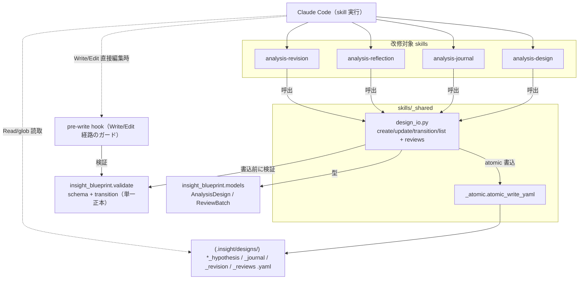
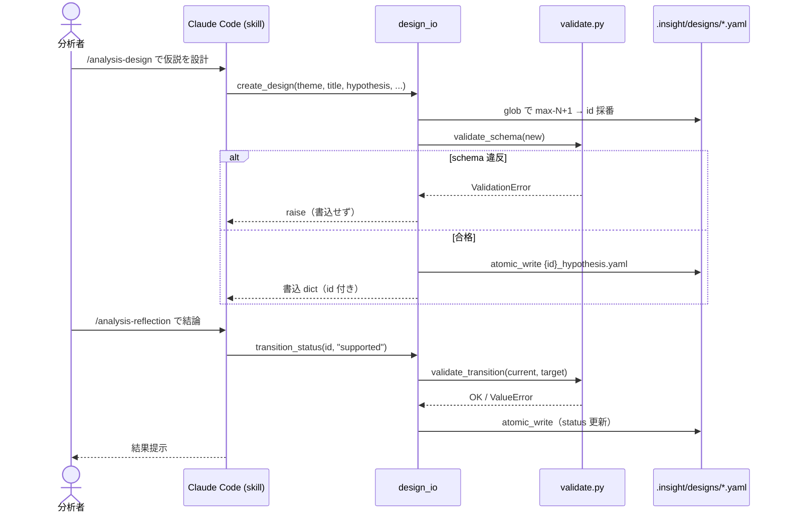

# Epic 03: skill を YAML 直接 I/O へ改修（設計書ライフサイクル）

/ ADR-0001 ロードマップ E3。設計書 CRUD を MCP tool 経由から skill による `.insight/` YAML 直接 I/O へ移す。
本 Epic は **設計書ライフサイクル**（design / journal / reflection / revision）に限定し、catalog・premortem・
lineage の変換は E3.5 に分離する（[ADR-0003](../adr/0003-skill-yaml-io-via-design-io.md)）。

## Acceptance Criteria

- [x] AC1: `skills/_shared/design_io.py` が設計書 CRUD（create/update/get/list/transition）と reviews
  batch の読み書きを純 Python で提供し、書込前に `validate.py` を呼ぶ
- [x] AC2: analysis-design / analysis-journal / analysis-reflection / analysis-revision の SKILL.md が
  MCP tool（`create_analysis_design` 等）でなく design_io を使う（残存 MCP CRUD 参照ゼロを確認）
- [x] AC3: 生成 YAML が現 DesignService 産と同形（id 形式 `{theme}-H{nn}` / JST timestamp / schema）
- [x] AC4: `tests/test_design_io.py`（20 件）が CRUD・id 衝突回避・merge・transition・reviews を網羅し全緑
- [x] AC5: MCP サーバは温存（E3 では未削除）。既存 server テストは緑のまま（958 passed / 1 skipped）

## Glossary

| Term | Meaning |
|---|---|
| design_io | `skills/_shared/design_io.py`。設計書/journal/reviews の YAML 直接 I/O ヘルパ |
| 設計書ライフサイクル | hypothesis / journal / revision / reviews YAML の作成・更新・状態遷移 |
| pre-write hook | `.claude/hooks/validate-design.py`。Write/Edit ツール経由の hypothesis 書込を検証 |
| E3.5 | catalog/premortem/lineage の MCP→YAML 変換（本 Epic 範囲外、E4 前に実施） |

## Scope

本 Epic は [ARCHITECTURE.md](../ARCHITECTURE.md) の **Skill layer ↔ Skill-managed YAML** の結線を、
MCP server を介さない直接 I/O に置き換える段階。[PRD.md](../PRD.md) の要件
「分析設計・journal・reflection・revision を skill 経由で作成・更新できる」を server-free で満たす。

- **Epic 範囲内**: analysis-design / -journal / -reflection / -revision の MCP 依存除去、
  `design_io.py` 新設、hypothesis/journal/revision/reviews YAML の直接 I/O。
- **Epic 範囲外**: catalog-register / premortem / data-lineage の MCP 変換（**E3.5**）、
  MCP サーバ層削除（**E4**）、catalog 検索の FTS5 脱却（E3.5/E5）。
- **依存**: 本 Epic 完了後も catalog/premortem/lineage が MCP を呼ぶため、**E4 はまだ実行不可**（E3.5 が前提）。

## Architecture

design_io は MCP server / core サービスに依存しない。`validate.py` と `models/` のみ再利用（どちらも E4 後も存続）。

## Module Responsibilities

各モジュールの「責務（何をする）」と「境界（何をしない・どこへ委譲するか）」。責務外は右列の
モジュールの領分。design_io 自身は **I/O とオーケストレーション**に徹し、検証は `validate.py`、
モデル定義は `models/`、原子書込は `_atomic` に委譲する。

| モジュール / 関数 | 責務（する） | 境界（しない → 委譲先） |
|---|---|---|
| `design_io.create_design` | id 生成（max-N+1 `{theme}-H{nn}`）・theme_id 検証・既定値・`now_jst`・書込 | スキーマ検証はしない → `validate.validate_schema`。原子書込 → `_atomic.atomic_write_yaml` |
| `design_io.update_design` | 既存読込→merge→`updated_at`更新→`referenced_knowledge` ユニオン dedup→書込 | schema+transition 検証はしない → `validate.validate_design_change` |
| `design_io.transition_status` | status 変更と書込 | 遷移可否判定はしない → `validate.validate_transition`（`VALID_TRANSITIONS`） |
| `design_io.load_design` / `list_designs` | `*_hypothesis.yaml` の Read / glob | 書込・検証はしない（読取専用） |
| `design_io.append_review_batch` / `list_review_batches` | `*_reviews.yaml` の batch 追記・列挙、続けて transition | comment 妥当性はモデル（`ReviewBatch`/`BatchComment` + `ALLOWED_TARGET_SECTIONS`）に委譲 |
| `design_io.load_journal` / `write_journal` | `*_journal.yaml` の read/write（自由 YAML） | スキーマ検証しない（journal は skill 管理・非検証） |
| `design_io` CLI | skill からの起動口（stdin JSON → 関数 → stdout JSON） | ロジックを持たない（各関数へ委譲）・対話しない |
| `analysis-{design,journal,reflection,revision}` SKILL.md | ユーザーとの対話・意思決定・design_io 呼出 | YAML の直接組み立て/検証はしない → design_io |
| （外部・他 Epic 領分）`insight_blueprint.validate` | 検証の**単一正本**（schema + transition） | design_io と pre-write hook の双方から呼ばれる（E2 で確立、E4 後も存続） |
| （外部・他 Epic 領分）pre-write hook | **Write/Edit ツール経由**の `*_hypothesis.yaml` 直接編集を検証 | id 生成/merge はしない（それは design_io の責務） |

## Sequence Diagram

設計書作成〜レビュー〜結論の代表フロー。

外部境界（YAML 読書き）は design_io / Read ツールに閉じる。validate.py は I/O を持たない。

## Data Model

新規スキーマ無し。既存 `AnalysisDesign`（hypothesis）/ `ReviewBatch`+`BatchComment`（reviews）を再利用。
design_io の入出力は dict（YAML 同形）。journal/revision は skill 管理の自由 YAML（既存作法）。

## Decisions

### Decision: direct-edit-bypass-accepted

- **What**: Claude Code が design_io を介さず設計書を直接編集する経路を許容するか。
- **答え**: 許容する。ただし2経路を区別する:
  1. **Write/Edit ツール経由の直接編集** — pre-write hook（`.claude/hooks/validate-design.py`）が
     発火し `validate.py` で schema + 遷移を検証する。**素通りではない**。design_io を介さないことで
     失うのは id 生成 / timestamp / `referenced_knowledge` merge / reviews 追記といった**利便**だけで、
     整合性（schema・遷移）は hook が担保する。
  2. **ツールを介さない生の python 書込**（外部スクリプト等）— hook も design_io も通らずガード外。
     これは ADR-0001 §Negative で受容済みの残余リスク（発生経路が限定的なため許容）。
- **含意**: `validate.py` が唯一の検証正本で、design_io（skill 経路）と hook（ツール直接編集経路）の
  双方が呼ぶ。design_io は「正しく速く書くための利便レイヤ」であって、整合性の最後の砦は hook。
- **推奨運用**: skill からは design_io を使う。手直しで hypothesis.yaml を直接編集した場合も hook が
  検証するので安全だが、id/timestamp の一貫性のため通常は design_io 経由を推す。

### Cross-epic decisions (links to ADR)

- [ADR-0001](../adr/0001-drop-mcp-server-embed-validation.md) — MCPサーバ廃止・検証埋め込み
- [ADR-0003](../adr/0003-skill-yaml-io-via-design-io.md) — skill→YAML I/O を design_io に集約 /
  validate.py を hook と design_io の二経路で再利用 / python 直接書込は hook を迂回するため
  design_io が自前検証 / ロードマップに E3.5 を挿入

## Test Design Matrix

| Story \ Layer | Unit | Integration | E2E |
|---|---|---|---|
| Story 3.1 design_io | ✓ (test_design_io 20) | ✓ (CLI subprocess) | ✓ (CLI create→transition) |
| Story 3.2 design/journal skill | — | — | ✓ (CLI 経路で確認) |
| Story 3.3 reflection/revision skill | — | — | ✓ (CLI 経路で確認) |

完了時に ✓。pytest 全緑が Epic PR レビューゲート。

## Story Timeline

- 2026-06-30 — Epic 03 起票: main から epic/3-skills-yaml-io を切り、Design Doc + ADR-0003 作成。
- 2026-06-30 — Story 3.1 完了: design_io.py 新設（CRUD/transition/reviews/CLI）+ test_design_io 20 件。typecheck に skills/ を追加。
- 2026-06-30 — Story 3.2 完了: analysis-design / -journal を design_io へ。「MCP-Only Editing」節を直接 I/O + hook 検証へ書換。
- 2026-06-30 — Story 3.3 完了: analysis-reflection / -revision を design_io へ。ADR-0001 / PRD / ARCHITECTURE のロードマップに E3.5 を追記。
