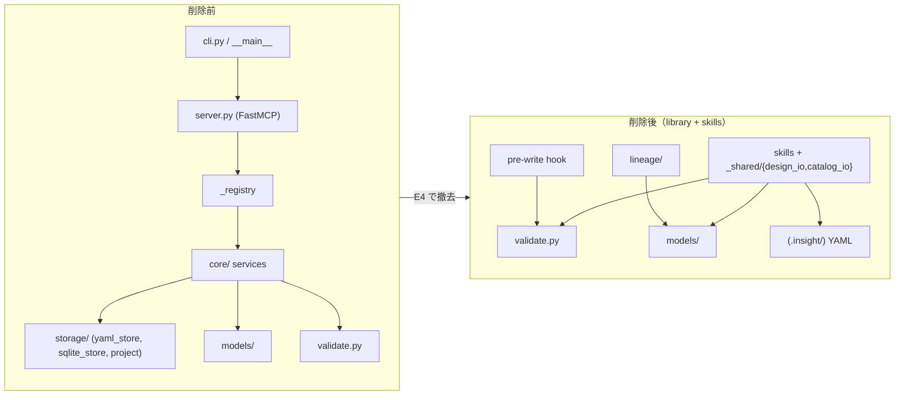
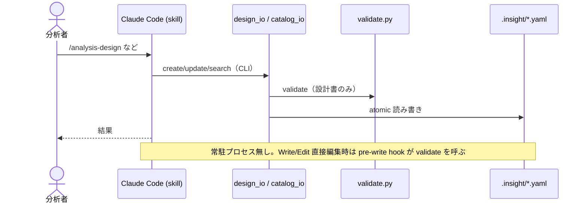

# Epic 04: MCPサーバ層の削除

/ ADR-0001 案C の最終実装段。E2（検証の埋め込み化）・E3/E3.5（skill を YAML 直接 I/O 化）で
skill 側の MCP 依存がゼロになったため、MCPサーバ層一式を削除する。`insight_blueprint` は
「埋め込み検証ライブラリ（validate/models）+ lineage + skills plugin」に縮む。

## Acceptance Criteria

- [ ] AC1: `server.py` / `cli.py` / `__main__.py` / `_registry.py` / `core/` / `storage/` が削除される
- [ ] AC2: 生存資産（`validate.py` / `models/` / `lineage/` / `_templates/`）のみで `pytest` 全緑
- [ ] AC3: `pyproject.toml` から fastmcp/click/uvicorn/packaging 依存と `[project.scripts]` を除去、
  `.mcp.json` / plugin マニフェストからサーバ記述を除去
- [ ] AC4: README / CLAUDE.md / PRD / ARCHITECTURE がサーバ非依存の実態に更新される
- [ ] AC5: 削除層（core/storage/server/_registry/cli）への参照が repo 全体でゼロ（grep 確認）

## Glossary

| Term | Meaning |
|---|---|
| サーバ層 | FastMCP サーバ（`server.py`）+ サービス（`core/*`）+ storage（`storage/*`）+ 起動（`cli.py`/`_registry.py`） |
| 生存資産 | `validate.py`（検証正本）/ `models/`（Pydantic）/ `lineage/`（marimo リネージ）/ `_templates/` |
| io ヘルパ | `skills/_shared/design_io.py` / `catalog_io.py`（E3/E3.5。サービス層の役割を server-free で代替） |

## Scope

[ARCHITECTURE.md](../ARCHITECTURE.md) の不変条件「No daemon / No MCP server / No SQLite」を**実体化**する最終段。
[PRD.md](../PRD.md) の非機能要件「常駐プロセスを持たない」を満たす。

- **範囲内**: サーバ/サービス/storage 層の削除、依存・設定・plugin マニフェスト整理、ドキュメント再フレーム。
- **範囲外**: catalog 柔軟化 / premortem 自立化 / knowledge 抽出強化（**E5**）。
- **前提**: E3.5 完了で全 skill が MCP-free（本 Epic の実行可能条件）。

## Architecture

## Module Responsibilities

削除対象と生存資産の責務・境界。「境界」は削除後にその役割を誰が担うか。

| モジュール | 削除前の責務 | E4 後（境界・後継） |
|---|---|---|
| `server.py` | FastMCP tool 群の公開 | 削除。skill が io ヘルパを直接呼ぶ（tool 公開は不要） |
| `cli.py` / `__main__.py` | MCP サーバ起動（stdio/headless） | 削除。常駐起動という概念自体を廃止 |
| `_registry.py` | サービスの単一配線 | 削除。DI 対象（サービス）が消えるため不要 |
| `core/{designs,reviews,catalog,rules}.py` | 設計/レビュー/カタログ CRUD | 削除 → `design_io` / `catalog_io`（E3/E3.5）が代替 |
| `core/validation.py` | SAFE_ID チェック | 削除 → `catalog_io` にローカル複製済み |
| `storage/yaml_store.py` | 原子 YAML I/O | 削除 → `skills/_shared/_atomic.py` が代替 |
| `storage/sqlite_store.py` | FTS5 検索 | 削除 → `catalog_io.search`（glob+射影）が代替 |
| `storage/project.py` | .insight scaffold + CLAUDE.md 生成 + MCP登録 | 削除（唯一のトリガー cli.py が消え orphan。§Decisions 参照） |
| `validate.py` | schema + transition 検証 | **KEEP**（正本。io ヘルパと hook が呼ぶ） |
| `models/` | Pydantic データモデル | **KEEP**（io ヘルパ・validate が使用） |
| `lineage/` | marimo リネージ | **KEEP**（models のみ依存、server 非依存） |
| `_templates/` | notebook 等テンプレ資産 | **KEEP** |

## Sequence Diagram

E4 後の実行時インタラクション（サーバ不在）。

## Data Model

変更なし。既存 `models/`（design/catalog/review/common）を生存資産として維持。

## Decisions

### Decision: delete-storage-project

- **What**: `storage/project.py`（init_project + CLAUDE.md 管理セクション生成 + `_register_mcp_server`）を削除する。
- **Why**: 唯一の実行時トリガー `cli.py` が本 Epic で消えるため orphan 化する。skill はディレクトリを必要時に
  自動作成し、init を必要としない。CLAUDE.md 自動生成の文面は MCP ツール前提で陳腐化している。
- **Consequences**: テストの `tmp_project` fixture と `test_claude_md_and_rules.py` も削除。将来オンボーディング用の
  scaffold が必要になれば E5 で server-free に再設計する。

### Cross-epic decisions (links to ADR)

- [ADR-0001](../adr/0001-drop-mcp-server-embed-validation.md) — 本 Epic はその「MCPサーバ廃止」の実装段。

## Test Design Matrix

| Story \ Layer | Unit | Integration | E2E |
|---|---|---|---|
| Story 4.1 削除 | ✓ (生存テスト全緑) | ✓ (premortem integration 緑) | — |
| Story 4.2 config/deps | — | ✓ (wheel build / packaging) | — |
| Story 4.3 docs | — | — | — |

完了時に ✓。pytest 全緑が Epic PR レビューゲート。

## Story Timeline

- 2026-07-01 — Epic 04 起票: main から epic/4-remove-mcp-server を切り、Design Doc 作成。
