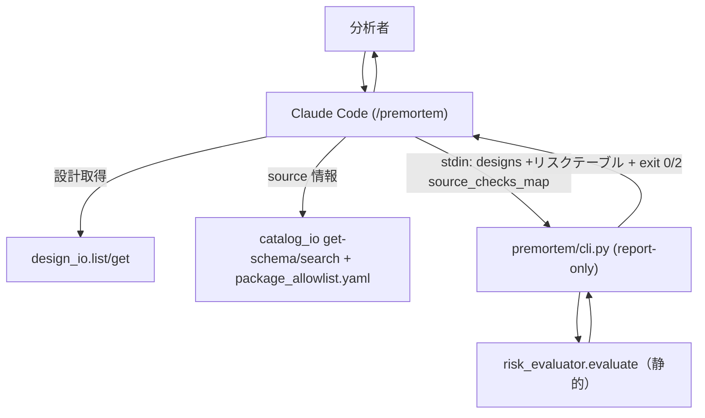
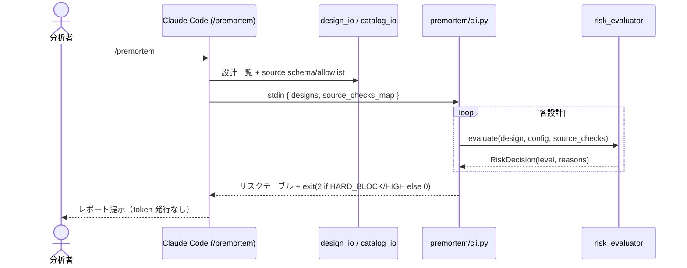

# Epic 05a: premortem 自立化（report-only の事前リスク評価）

/ E5 の第1弾。batch-analysis 撤去（E3.5）とサーバ削除（E4）で premortem は token/run 履歴/manifest といった
batch 実行前提の機構が orphan 化した。これらを撤去し、premortem を**副作用のない静的リスク評価レポート**に純化する。

## Acceptance Criteria

- [ ] AC1: token / run 履歴 / manifest / allowlist_loader の死んだ機構が撤去される
  （token_manager / manifest_writer / crash_recovery / history_query / allowlist_loader）
- [ ] AC2: `risk_evaluator` が履歴 extrapolation を持たず**静的評価のみ**（source/allowlist/location + 行数しきい値）
- [ ] AC3: `premortem/cli.py` が **report-only**（token 発行なし、`.insight/premortem/` へ書かない）。
  HARD_BLOCK/HIGH があれば exit 2、無ければ 0
- [ ] AC4: premortem SKILL.md が自立レポートに再フレーム（gate/batch/token/`--queued` 記述なし）
- [ ] AC5: `pytest` 全緑、撤去シンボルの参照ゼロ

## Glossary

| Term | Meaning |
|---|---|
| report-only | token/承認を発行せず、リスク判定を出力するだけの動作 |
| source_checks_map | 設計ごとの事前チェック結果（source_registered/location_ok/allowlist_ok/estimated_rows）。skill が構築 |
| 静的評価 | 過去 run 履歴に依らず、登録/allowlist/location と行数しきい値のみで判定 |

## Scope

- **範囲内**: premortem の batch 残骸撤去、risk_evaluator 静的化、cli report-only 化、SKILL 再フレーム。
- **範囲外**: knowledge 抽出（E5b）、catalog 柔軟化（E5c）、design 単位履歴の新設（YAGNI・将来）。

## Architecture

撤去: `token_manager` / `manifest_writer` / `crash_recovery` / `history_query` / `allowlist_loader` と `.insight/{runs,premortem}`。

## Module Responsibilities

| モジュール | 責務（する） | 境界（しない → 委譲先 / 撤去） |
|---|---|---|
| `premortem/cli.py` | stdin の designs+source_checks を受け、設計ごとに静的リスク判定してテーブル出力、exit code 決定 | token 発行・承認・mode 分岐・履歴参照はしない（**撤去**） |
| `premortem/lib/risk_evaluator.py` | 静的判定（SKIP/HARD_BLOCK/HIGH/MEDIUM/LOW） | 履歴 extrapolation はしない（**撤去**） |
| `_shared/models.py` | RiskLevel / RiskDecision / SourceChecks / PremortemConfig | run/history/token 系 dataclass は保持しない（**撤去**） |
| `_shared/config_loader.py` | `.insight/config.yaml` から静的しきい値を読む | history/token/batch キーは読まない |
| skill (SKILL.md) | design_io/catalog_io で source_checks_map を組み cli に渡す・結果提示 | 実行ゲートはしない（レポートのみ） |
| （撤去）token_manager/manifest_writer/crash_recovery/history_query/allowlist_loader | — | 消費者不在のため削除 |

## Sequence Diagram

## Data Model

`RiskDecision`（`extrapolated_time_min` 削除）/ `SourceChecks` / `PremortemConfig`（`static_rows_high` /
`static_rows_medium` のみ）に整理。Token/Run/Manifest/History dataclass は削除。

## Decisions

### Decision: remove-token-report-only

- **What**: approval token と `.insight/premortem/` 書込を撤去し、premortem を report-only にする。
- **Why**: token の消費者（batch-analysis 実行ゲート）が E3.5 で消え、誰も verify しない。永続記録が要るなら
  journal 側に残せる。消費者不在の成果物を残さない。
- **Consequences**: mode（manual/review/auto）・approved_by・token TTL・token_manager が不要になり撤去。

### Decision: remove-run-history-infra

- **What**: run 履歴（`.insight/runs`）読取と manifest_writer/crash_recovery/history_query を撤去し、
  risk_evaluator を静的評価のみにする。
- **Why**: `.insight/runs` を書く batch-analysis が消え、history は常に空→extrapolation は死んでいた。
  投機的インフラ（旧案C の design 履歴）は今作らない（YAGNI）。
- **Consequences**: history 系 config/dataclass 撤去。判定は登録/allowlist/location + 行数しきい値のみ。

### Cross-epic decisions (links to ADR)

- [ADR-0001](../adr/0001-drop-mcp-server-embed-validation.md) — E5 は §Related ロードマップの最終段。

## Test Design Matrix

| Story \ Layer | Unit | Integration | E2E |
|---|---|---|---|
| Story 5a.1 infra/risk | ☐ (risk_evaluator/config 静的) | — | — |
| Story 5a.2 cli/skill | ☐ (cli report-only) | ☐ (premortem io contract) | ☐ (stdin→表→exit) |

完了時に ✓。pytest 全緑が Epic PR レビューゲート。

## Story Timeline

- 2026-07-01 — Epic 05a 起票: main から epic/5a-premortem-standalone を切り、Design Doc 作成。
