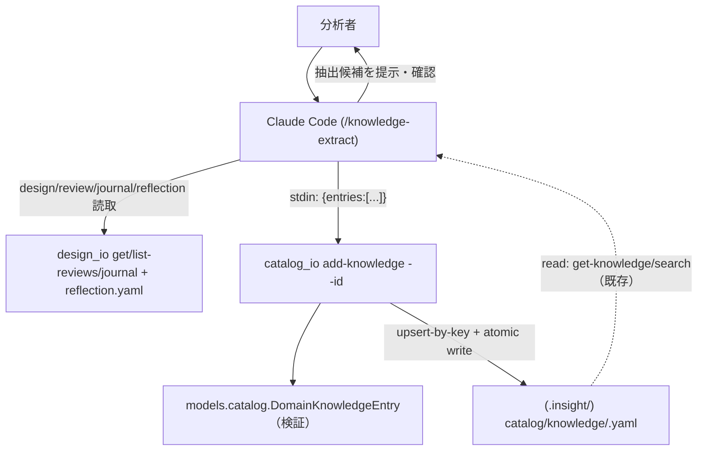
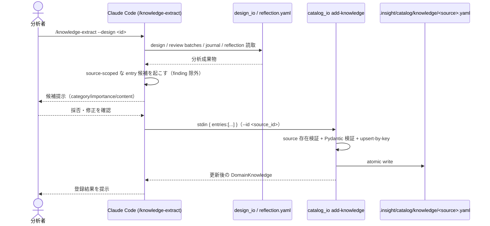

# Epic 05b: knowledge 抽出強化（Claude-native + source-scoped）

E5 の第2弾。E4 のサーバ削除で `core/reviews.py::ReviewService` の knowledge 抽出
（正規表現ベースの `extract_domain_knowledge` / `save_extracted_knowledge` /
terminal 時の finding 自動抽出）が消え、catalog knowledge は **read 専用**のまま残った
（`catalog_io` に `# writing/extraction is E5` と明記）。本 Epic で write パスを新設し、
抽出を **Claude-native** に置き換える。

## Acceptance Criteria

- [x] AC1: `catalog_io` に write パス `add-knowledge`。source 存在検証 + entry の Pydantic
  検証 + `key` による upsert + atomic write。read 側（get-knowledge/search）と同じ idiom
- [x] AC2: 抽出は Claude-native。新 skill `/knowledge-extract` が design の
  review/journal/reflection を読み、**source-scoped** な `DomainKnowledgeEntry` 候補を
  起こす → ユーザー確認 → `catalog_io add-knowledge` に流す
- [x] AC3: 分析結論（`finding`）は catalog に入れない。skill は `finding` category を emit せず、
  結論は reflection/journal に残す（E5a と同じ「消費者のいない永続を作らない」哲学）
- [x] AC4: `analysis-reflection` が結論時に `/knowledge-extract` を提案（source 知識の刈り取り）
- [x] AC5: `pytest` 全緑（343 passed）。unit（add_knowledge: append / upsert-by-key /
  unknown-source / invalid-entry / invalid-category）+ integration（CLI stdin→file の E2E）

## Glossary

| Term | Meaning |
|---|---|
| source-scoped knowledge | データソースに紐づく再利用可能な事実（列の欠損傾向・定義・注意・文脈）。`catalog/knowledge/<source>.yaml` に格納 |
| Claude-native 抽出 | 正規表現でなく Claude が review/reflection を読んで knowledge 候補を構造化する方式 |
| upsert-by-key | 同一 `key` の entry があれば置換、無ければ追加。再抽出で内容更新できる |
| finding | 分析結論。source に紐づかないため catalog ではなく reflection/journal に残す |

## Scope

- **範囲内**: `catalog_io add-knowledge`（write/append/upsert）、`/knowledge-extract` skill
  （Claude-native）、`analysis-reflection` からの導線、unit/integration テスト。
- **範囲外**: catalog モデルの柔軟化（SourceType/Category を free string 化 = E5c）、
  finding の catalog 永続（不採用）、正規表現抽出の移植（不採用）、旧フラット
  `rules/extracted_knowledge.yaml` の移行（未追跡の空スタブ・廃止）。

## Architecture

不採用: 正規表現 `_CATEGORY_PATTERNS`、`rules/extracted_knowledge.yaml`（フラット）、
terminal 時の finding 自動抽出。

## Module Responsibilities

| モジュール | 責務（する） | 境界（しない → 委譲先 / 撤去） |
|---|---|---|
| `_shared/catalog_io.py::add_knowledge` | source 検証・entry 検証・key upsert・atomic write | 抽出（category 判定・要約）はしない → Claude |
| `catalog_io` CLI `add-knowledge` | stdin `{entries:[...]}` を受け `--id` の source に永続、結果を出力 | 対話・確認はしない → skill |
| skill `/knowledge-extract` (SKILL.md) | design 成果物を読み source-scoped 候補を起こし、確認して add-knowledge に流す | 正規表現抽出はしない、`finding` を emit しない（**不採用**） |
| skill `/analysis-reflection` | 結論時に `/knowledge-extract` を提案 | 抽出そのものはしない → knowledge-extract |
| `models.catalog`（既存） | DomainKnowledge(Entry) の検証契約 | 変更なし（柔軟化は E5c） |
| （不採用）reviews.py の regex 抽出 / finding 自動抽出 | — | 消費者不在・弱い精度のため復元しない |

## Data Flow

外部境界: ファイルシステム（`.insight/designs/*.yaml` 読取、`.insight/catalog/knowledge/<source>.yaml` 書込）。
ネットワーク・外部 API なし。

## Sequence Diagram

## Data Model

既存 `DomainKnowledgeEntry`（`key` / `title` / `content` / `category` / `importance` /
`source` / `affects_columns`）と `DomainKnowledge(source_id, entries[])` を変更なしで使う。
dedup は `key`。`finding` category は enum に残るが skill からは出さない。

## Decisions

### Decision: knowledge-write-in-catalog-io

- **What**: knowledge の write パスを `catalog_io.add_knowledge`（+ CLI `add-knowledge`）として
  新設し、source-scoped（`catalog/knowledge/<source>.yaml`）に upsert-by-key で永続する。
- **Why**: read 側は既に catalog_io / source-scoped に確立済み。旧 `rules/extracted_knowledge.yaml`
  はフラットで catalog 以前の遺物。書き手を read と同じモジュール・同じレイアウトに揃える。
- **Consequences**: 旧フラットファイルは廃止（未追跡の空スタブ）。write も read と同じ
  token-lean idiom（stdin→検証→atomic write）に一本化。

### Decision: claude-native-extraction

- **What**: 抽出エンジンを Claude-native にする。正規表現 `_CATEGORY_PATTERNS` は復元せず、
  Claude が review/reflection を読んで entry を構造化する。ライブラリは validate+persist に純化。
- **Why**: skill+Claude 世界では Claude が最強の抽出器。regex の category 推定は弱く、
  「抽出強化」の本命は LLM 化。ライブラリに弱い抽出ロジックを持たない。
- **Consequences**: `extract_domain_knowledge` の regex は移植しない。抽出品質は prompt に宿る。

### Decision: findings-stay-in-reflection

- **What**: 分析結論（`finding`）を catalog に自動抽出しない。結論は reflection/journal に残す。
- **Why**: finding は特定 source に紐づかない分析結論で、source-scoped catalog に馴染まない。
  E5a と同じ「消費者のいない永続を作らない」哲学。reflection が既に結論の器。
- **Consequences**: `_extract_finding_if_terminal` は復元しない。catalog knowledge は
  再利用可能な source 知識だけに純化。

### Cross-epic decisions (links to ADR)

- [ADR-0001](../adr/0001-drop-mcp-server-embed-validation.md) — E5 は §Related ロードマップの最終段。

## Test Design Matrix

| Story \ Layer | Unit | Integration | E2E |
|---|---|---|---|
| Story 5b.1 add-knowledge | ✓ (append/upsert/unknown-source/validation) | ✓ (CLI stdin→file) | — |
| Story 5b.2 skill/docs | — | — | ✓ (skill 手順の整合) |

完了時に ✓。pytest 全緑が Epic PR レビューゲート。

## Story Timeline

- 2026-07-02 — Epic 05b 起票: main から epic/5b-knowledge-extraction を切り、Design Doc 作成。
- 2026-07-02 — Story 5b.1 完了: catalog_io.add_knowledge（source検証+検証+key upsert+atomic write）
  + CLI add-knowledge + unit/integration。pytest 343 passed。
- 2026-07-02 — Story 5b.2 完了: /knowledge-extract skill 新設（Claude-native, source-scoped,
  finding除外）、analysis-reflection / catalog-register の導線繋ぎ替え、CLAUDE/PRD/ARCHITECTURE 更新。
