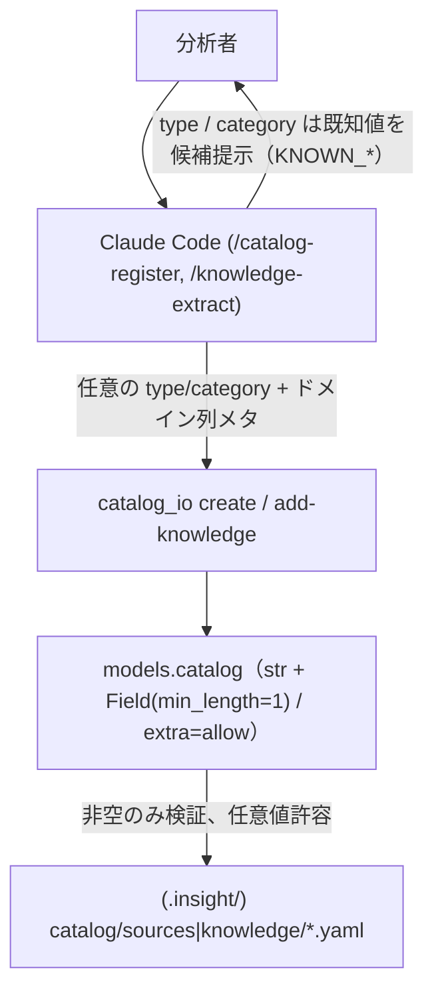
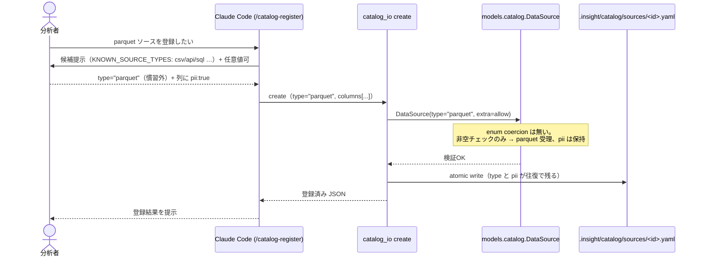

# Epic 05c: catalog 柔軟化（open string taxonomy）

E5 の最終弾。catalog モデルの閉じた enum（`SourceType` 3値 / `KnowledgeCategory` 5値）と
`ColumnSchema` の `extra="ignore"` が、新種の source・分野固有の category・ドメイン固有の
列メタを弾いていた。これを **open string + `extra="allow"`** に緩め、追加のたびの
ライブラリ改変+リリースをなくす。公開契約の変更なので [ADR-0004](../adr/0004-open-string-catalog-taxonomy.md) を切る。

## Acceptance Criteria

- [x] AC1: `SourceType` / `KnowledgeCategory` enum を廃し、`DataSource.type` /
  `DomainKnowledgeEntry.category` を非空 `str` に。慣習値は `KNOWN_SOURCE_TYPES` /
  `KNOWN_KNOWLEDGE_CATEGORIES` 定数で公開、`finding` は `FINDING` 定数で保持
- [x] AC2: `ColumnSchema` / `DataSource` を `extra="allow"` に（列の `pii` 等が往復で保持される）
- [x] AC3: `KnowledgeImportance` は閉じた enum のまま（順序尺度）
- [x] AC4: `catalog_io` の `SourceType()` / `KnowledgeCategory()` コアシオンを除去
  （create は非空のみ、category filter は完全一致）
- [x] AC5: `catalog-register` / `knowledge-extract` を「既知値+自由」に汎用化
- [x] AC6: ADR-0004 記録。`pytest` 全緑（351 passed）

## Glossary

| Term | Meaning |
|---|---|
| open string taxonomy | 種別を enum でなく非空 str で表し、任意値を許容する方式 |
| KNOWN_* 定数 | 慣習値のタプル。検証には使わず UX ヒント（skill の候補提示）に使う |
| extra="allow" | Pydantic の設定。未知フィールドを捨てず保持する |

## Scope

- **範囲内**: catalog モデルの enum→str 化 + `extra="allow"`、`catalog_io` の coercion 除去、
  2 skill の語彙汎用化、ADR-0004、docs 更新。
- **範囲外**: design 側モデル（既に `extra="allow"` + enum、[test_design_models] 参照）、
  `KnowledgeImportance` の緩和（不採用）、validator ハイブリッド（ADR-0004 で却下）、
  `CLAUDE.md.template` の E3.5/E4 残存負債（別途）。

## Architecture

## Module Responsibilities

| モジュール | 責務（する） | 境界（しない → 委譲先） |
|---|---|---|
| `models.catalog` | `type`/`category` を非空 str で検証、`extra="allow"` で未知フィールド保持、`KNOWN_*`/`FINDING` 公開 | 慣習値の強制はしない（enum 廃止）→ skill の候補提示 |
| `models.catalog.KnowledgeImportance` | high/medium/low を閉じた enum で検証 | 緩和しない（順序尺度） |
| `_shared/catalog_io` | create/add-knowledge で str をそのまま渡す、category filter は完全一致 | enum coercion はしない（**除去**） |
| skill `/catalog-register` | 既知 source type を候補提示しつつ任意値も受ける | 値の強制はしない |
| skill `/knowledge-extract` | 既知 category を候補提示しつつ分野固有値も受ける | 値の強制はしない、`finding` は emit しない（E5b） |

## Sequence Diagram

E5c は「enum coercion による拒否」を「非空 str 検証 + 任意値受理」に置き換える。妙味は
分岐そのものより **どこで弾かれなくなったか**にあるので、慣習外の値（parquet）を登録する
フローで示す。skill は `KNOWN_*` を候補提示するが、ライブラリは非空でありさえすれば通す。

図の下段が E5c の核心: 旧実装なら `SourceType("parquet")` が `ValueError` で止まっていた地点を、
非空検証だけが通す。`extra="allow"` により `pii` などの未知フィールドも捨てられず残る。

## Data Model

| Field | Before | After |
|---|---|---|
| `DataSource.type` | `SourceType`(enum 3値) | `str` = `Field(min_length=1)` |
| `DomainKnowledgeEntry.category` | `KnowledgeCategory`(enum 5値) | `str` = `Field(min_length=1)` |
| `ColumnSchema` | `extra="ignore"`(既定) | `extra="allow"` |
| `DataSource` | `extra="ignore"` | `extra="allow"` |
| `KnowledgeImportance` | enum 3値 | 変更なし（閉） |
| 定数 | — | `KNOWN_SOURCE_TYPES` / `KNOWN_KNOWLEDGE_CATEGORIES` / `FINDING` |

## Decisions

### Cross-epic decisions (links to ADR)

- [ADR-0004](../adr/0004-open-string-catalog-taxonomy.md) — catalog の taxonomy を open string
  にする（公開契約=モデルの制約緩和。慣習値は `KNOWN_*` 定数、typo 耐性は skill の候補提示に委ねる）。

## Test Design Matrix

| Story \ Layer | Unit | Integration | E2E |
|---|---|---|---|
| Story 5c.1 model/io | ✓ (任意値許容/空拒否/extra 保持/importance 閉) | ✓ (catalog_io create/add-knowledge) | — |
| Story 5c.2 skill/docs | — | — | ✓ (skill 語彙の整合) |

完了時に ✓。pytest 全緑が Epic PR レビューゲート。

## Story Timeline

- 2026-07-02 — Epic 05c 起票: main から epic/5c-catalog-flexibility を切り、Design Doc 作成。
- 2026-07-02 — Story 5c.1 完了: enum→str+KNOWN 定数、extra=allow、catalog_io coercion 除去、
  model/io テスト更新。pytest 351 passed。
- 2026-07-02 — Story 5c.2 完了: ADR-0004 + 索引、catalog-register/knowledge-extract 汎用化、
  PRD/ARCHITECTURE/CLAUDE 更新。E5 完結。
