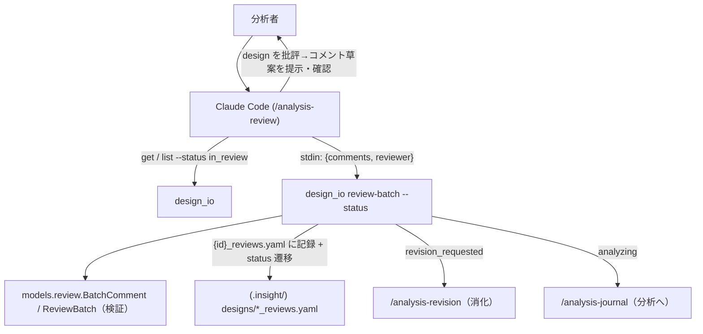
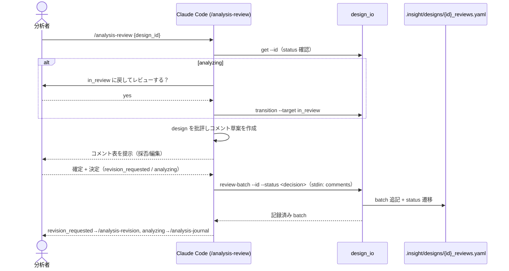

# Epic 06: /analysis-review — レビュー生産者スキル

WebUI 撤去（E1）で「分析 design のレビューを**生産**する経路」が消え、消費側
`/analysis-revision`（`revision_requested` のコメント消化）だけが残る片肺状態だった。
レビュー配管（`design_io review-batch` = `append_review_batch`）と状態遷移は既存で、
入口の skill だけが欠けていた。本 Epic で producer スキル `/analysis-review` を新設し、
**producer(`/analysis-review`) → consumer(`/analysis-revision`)** で UI 無しにレビュー
ループを自己完結させる。

## Acceptance Criteria

- [x] AC1: `skills/analysis-review/SKILL.md` 新設。reviewable（`in_review`/`revision_requested`）
  前提、`ALLOWED_TARGET_SECTIONS` 準拠、`BatchComment` 契約（`target_section` 設定時は
  `target_content` 必須／無しは general）を明記、`revision_requested`/`analyzing` の2決定
- [x] AC2: chaining 対称配線（design→review, review→revision, review→journal）+
  `analysis-reflection` のレビュー導線を producer(`/analysis-review`) に修正
- [x] AC3: `test_skill_structure` の `ALL_SKILLS` に追加、必須セクション + 双方向整合が pass
- [x] AC4: README（skills 一覧 / workflow 図 / Designs,status&review の producer/consumer 対）
  + CLAUDE §6 skill 表に反映
- [x] AC5: `pytest` 全緑（338 passed）、review-batch 配管の E2E 確認、`design_io`/`models` は無変更

## Glossary

| Term | Meaning |
|---|---|
| producer / consumer | レビューを*生産*する `/analysis-review` と、コメントを*消化*する `/analysis-revision` の対 |
| review batch | `{id}_reviews.yaml` に記録されるレビュー単位（コメント群 + `status_after` + reviewer） |
| reviewable | review batch を記録できる状態 = `in_review` / `revision_requested`（`_REVIEWABLE`） |
| target_section | コメントが指す設計セクション。`ALLOWED_TARGET_SECTIONS` に限定 |

## Scope

- **範囲内**: 新 skill `/analysis-review`、既存 skill の chaining 配線、reflection 導線修正、
  test/docs 反映。design/plan レビュー（結果 `revision_requested`=要修正 / `analyzing`=承認）が主。
- **範囲外**: `design_io`/`validate.py`/models の変更（配管・遷移・target 語彙・`BatchComment`
  契約は既存で十分）。結論づけ（supported/rejected/inconclusive の判断）は `/analysis-reflection`
  の領分。results-review の専用 UX 拡張。

## Architecture

コード変更なし: 既存 `append_review_batch` / `transition_status` / `VALID_TRANSITIONS` /
`ALLOWED_TARGET_SECTIONS` をそのまま利用。

## Module Responsibilities

| モジュール | 責務（する） | 境界（しない → 委譲先） |
|---|---|---|
| skill `/analysis-review` | reviewable な design を批評しコメント草案を作り、確認後 `design_io review-batch` で記録＋遷移 | コメントの消化はしない → `/analysis-revision`。結論づけはしない → `/analysis-reflection`。design 作成はしない → `/analysis-design` |
| `design_io.append_review_batch`（既存） | reviewable 検証・`BatchComment` 検証・`{id}_reviews.yaml` 追記・status 遷移 | 批評内容の生成はしない → skill(Claude) |
| skill `/analysis-revision`（既存） | `revision_requested` のコメントを逐次消化、`{id}_revision.yaml` で進捗管理 | レビューの生産はしない → `/analysis-review` |
| `models.review.BatchComment`（既存） | コメント契約（`target_section` 設定時は `target_content` 必須 等） | 変更なし |

## Sequence Diagram

## Data Model

新規モデルなし。既存を利用:
- `BatchComment`: `comment`（必須, 非空）/ `target_section`（None or `ALLOWED_TARGET_SECTIONS`）/
  `target_content`（`target_section` 設定時は必須）。
- `ReviewBatch`: `id` / `design_id` / `status_after` / `reviewer` / `comments[]`。
- 保存先 `{id}_reviews.yaml`（`_revision.yaml` は `/analysis-revision` の tracking で別物）。

## Decisions

### Decision: add-review-producer-skill

- **What**: レビューを生産する新 skill `/analysis-review` を足し、producer/consumer 対でループを閉じる。
- **Why**: WebUI（旧 producer）撤去で入口が消えた。配管（`design_io review-batch`）は既存なので
  薄い skill 1枚で「Claude が批評→バッチ記録→`/analysis-revision` が消化」が UI 無しで自己完結する。
- **Alternatives considered**: B「規約を文書化するだけ（skill を足さない）」→ 入口が skill 一覧に無く
  不親切。C「正式レビューループを畳む（reflection に寄せる）」→ 機能を捨てすぎ。いずれも却下。
- **Consequences**: skill 数 +1。`design_io`/models は無変更。results-review（終端判断）は引き続き
  `/analysis-reflection` の領分として分離。

### ADR は不要

本決定は Epic 内で完結し、不変条件（No daemon/MCP/SQLite・`validate.py` 単一正本）や
`docs/ARCHITECTURE.md` のコンポーネント構成を変えない（既存機構の上に skill を1枚足すのみ）。
よって cross-epic な ADR は作らず、この `## Decisions` に残す（CLAUDE.md §5 準拠）。

## Test Design Matrix

| Story \ Layer | Unit | Integration | E2E |
|---|---|---|---|
| Story 6.1 skill + 配線 + docs | ✓ (test_skill_structure: 必須節 + 双方向整合) | — | ✓ (review-batch 配管を tmp project で手動確認) |

完了時に ✓。pytest 全緑が Epic PR レビューゲート。

## Story Timeline

- 2026-07-03 — Epic 06 起票（#29）: main から epic/6-analysis-review を切り、Design Doc 作成。
- 2026-07-03 — Story 6.1 完了: `/analysis-review` 新設 + chaining 対称配線 + reflection 導線修正 +
  ALL_SKILLS 追加 + README/CLAUDE 更新。pytest 338 passed。review-batch 配管の E2E 確認済み
  （実装中に `BatchComment` の target_content 必須契約を E2E で検出し SKILL の例を修正）。
