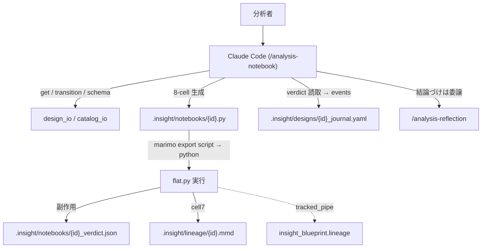
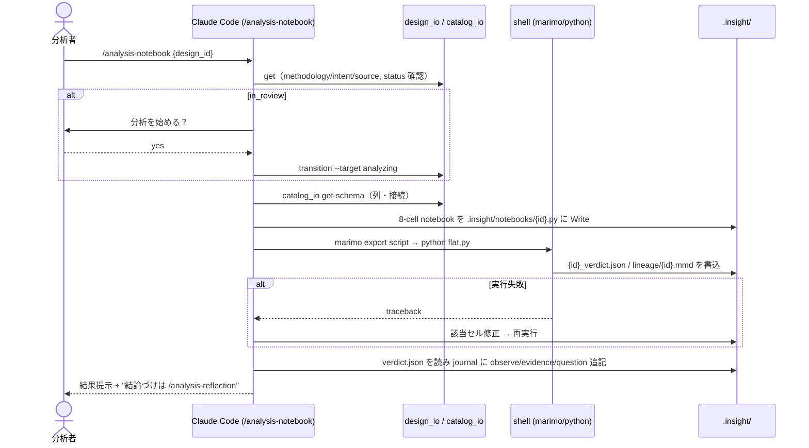

# Epic 07: /analysis-notebook — 分析ノートブック生成スキル

全体フロー点検（#31）で「design 確定 → marimo notebook 生成・実行 → 記録」の担い手 skill が
**不在**（batch-analysis 撤去 E3.5 の後継未実装、現状 ad-hoc）と確定した。本 Epic で対話型スキル
`/analysis-notebook` を新設し、design→分析の穴を埋める。旧 batch-analysis の 8-cell 契約・lineage 連携・
verdict→journal 変換を、headless/token/queue/time-budget の無人実行機構を捨てて移植する。
`(b)` 自律チェーンは依存順で次の Epic 08。

## Acceptance Criteria

- [x] AC1: `skills/analysis-notebook/SKILL.md` + `references/notebook-contract.md` 新設。design の
  `methodology` から 8-cell marimo notebook を生成し実行、verdict を journal（observe/evidence/question）に
  記録（`conclude` はしない）
- [x] AC2: 実行機構は `marimo export script` → `python flat.py`（marimo 0.21 に `export session` は無い）。
  verdict cell が `.insight/notebooks/{id}_verdict.json` を副作用書込、skill がそれを読む
- [x] AC3: lineage（`tracked_pipe` / `export_lineage_as_mermaid`）と design_io（get/transition/journal）を
  再利用。コア（design_io/validate/models）は無変更
- [x] AC4: 前提チェック + `[project.optional-dependencies] notebook`（marimo/pandas/matplotlib/numpy）追加。
  `uv add "insight-blueprint-lineage[notebook]"` で導入
- [x] AC5: chaining 対称配線（design/review→notebook→journal/reflection）+ `ALL_SKILLS` 追加、双方向整合 pass
- [x] AC6: README / ARCHITECTURE / CLAUDE §6 更新（#31 の「ad-hoc（skill なし）」を実スキルに）
- [x] AC7: `pytest` 全緑、marimo export script / lineage / verdict→journal の E2E 確認

## Glossary

| Term | Meaning |
|---|---|
| 8-cell contract | imports/meta/data_load/data_prep/analysis/viz/verdict/lineage の固定セル構成（references 参照） |
| verdict | 分析結論 dict（conclusion/evidence_summary/open_questions）。cell6 が JSON 副作用書込 |
| export script | marimo notebook を flat script に変換するサブコマンド。`python` で headless 実行（nbformat 不要） |

## Scope

- **範囲内**: 新 skill + 8-cell 契約 references、既存 chaining への配線、docs、`notebook` optional-extra。
  生成 + 実行 + journal 記録（AskUserQuestion で確定）。
- **範囲外**: 無人 headless 実行（token/queue/time-budget/self-review ループ）は復元しない。結論づけ（reflection）。
  自律チェーン（Epic 08）。design_io/validate/models の変更。

## Architecture

## Module Responsibilities

| モジュール | 責務（する） | 境界（しない → 委譲先） |
|---|---|---|
| skill `/analysis-notebook` | 8-cell notebook 生成・実行・verdict→journal 記録・lineage 出力 | 結論づけ（conclude）→ /analysis-reflection。design 変更 → /analysis-design |
| `references/notebook-contract.md` | 8-cell 契約・marimo 規約・実行コマンド・verdict→journal 変換の正本 | — |
| `insight_blueprint.lineage`（既存） | `tracked_pipe` 記録・`export_lineage_as_mermaid` 出力 | notebook 生成はしない → skill |
| `design_io`（既存） | get / transition(in_review→analyzing) / journal read-write | 変更なし（新 CLI は足さない） |
| marimo（optional-extra） | `export script` で flat script 化・実行基盤 | — |

## Sequence Diagram

## Data Model

新規モデルなし。既存を利用: `LineageSession` / `StepRecord`（lineage）、journal イベント（observe/evidence/
question、`{id}-E{nn}`）。生成物: `.insight/notebooks/{id}.py`（+ `_flat.py` / `_verdict.json` / 任意 `.html`）、
`.insight/lineage/{id}.mmd`。

## Decisions

### Decision: port-batch-analysis-contract-as-interactive-skill

- **What**: 旧 batch-analysis の 8-cell 契約を対話型スキル `/analysis-notebook` に移植する。
- **Why**: design→分析の担い手 skill が不在。契約と lineage 配管は実績があり、対話型に載せ替えるだけで穴が埋まる。
- **Alternatives considered**: 生成のみ（実行しない）→ フローが自動前進せず却下。headless 復活 → auto mode=対話型
  方針と乖離、Epic 08 で扱う。
- **Consequences**: 無人実行機構（token/queue/time-budget/self-review）は復元しない。skill 数 +1。

### Decision: execution-via-export-script-and-verdict-sideeffect

- **What**: 実行は `marimo export script` → `python flat.py`。verdict cell が `{id}_verdict.json` を副作用書込し
  skill が読む。
- **Why**: marimo 0.21 に旧仕様の `export session` は存在せず、`export ipynb --include-outputs` は `nbformat` 依存。
  `export script` は nbformat 不要で確定的、副作用 JSON は出力フォーマット解析に依存しない。実機 E2E で検証済み。
- **Consequences**: notebook 契約に「verdict を JSON 永続化」を含める。HTML export は任意の閲覧用。

### ADR は不要

既存の lineage/design_io/marimo 契約の上に skill を1枚足す Epic 内完結の決定で、不変条件・アーキテクチャ骨格を
変えない。よって cross-epic な ADR は作らず本 `## Decisions` に残す（CLAUDE.md §5）。

## Test Design Matrix

| Story \ Layer | Unit | Integration | E2E |
|---|---|---|---|
| Story 7.1 skill + 契約 + 配線 | ✓ (test_skill_structure: 必須節 + 双方向整合、test_plugin_structure: exist/frontmatter/version) | ✓ (tests/integration/test_analysis_notebook_contract.py) | ✓ (同上: 8-cell 参照 notebook → export script → 実行 → verdict.json / lineage.mmd) |
| Story 7.2 docs + optional-extra | — | — | — |

完了時に ✓。pytest 全緑が Epic PR レビューゲート。E2E は
`tests/integration/test_analysis_notebook_contract.py`（`importorskip("marimo")` ガード、
参照 notebook `tests/integration/fixtures/sample_notebook.py`）で裏付ける。

## Story Timeline

- 2026-07-03 — Epic 07 起票（#32）: main から epic/7-analysis-notebook を切り、Design Doc 作成。
- 2026-07-03 — Story 7.1/7.2 完了: `/analysis-notebook` + references/notebook-contract.md 新設、chaining 対称配線、
  ALL_SKILLS 追加、README/ARCHITECTURE/CLAUDE 更新、`notebook` optional-extra 追加。pytest 全緑。
  marimo 0.21 の実行機構を実機検証（`export session` 不在を発見し `export script`+verdict 副作用に是正）。
