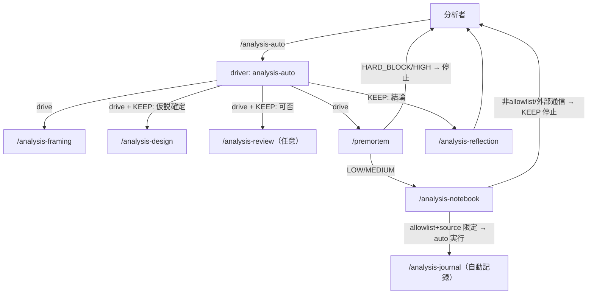
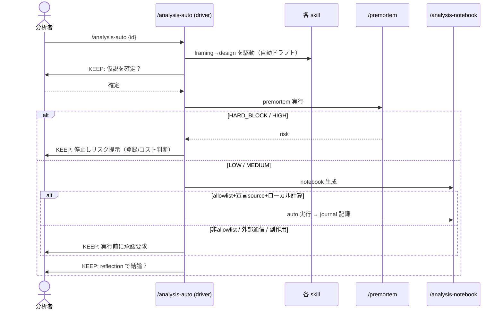

# Epic 08: /analysis-auto — guided autopilot（b: 自律チェーン）

Epic 07 で design→分析(notebook) の穴が埋まった。本 Epic（b）は「本当の判断が要るまで手動 `/command`
無しで進める」自律チェーンを、**driver スキル `/analysis-auto` による guided autopilot** として実装する。
全 skill は意図的に明示・対話型（`disable-model-invocation: true`, #31）で、`/analysis-notebook` はコード実行を
伴う（Epic 07 security）。素朴な invocation 全解放は安全策を壊すため採らない。cross-epic な相互作用モデル
改定なので [ADR-0005](../adr/0005-selective-autonomous-chaining.md) を伴う。

## Acceptance Criteria

- [x] AC1: [ADR-0005](../adr/0005-selective-autonomous-chaining.md)（selective autonomous chaining）+ ADR 索引追記
- [x] AC2: `skills/analysis-auto/SKILL.md`（driver）。既存 skill を**駆動**（再実装しない）し、ゲート方針を表で明記。
  KEEP ゲートで停止 / AUTO は自動進行。個々の skill の `disable-model-invocation` は不変
- [x] AC3: premortem を notebook 前の pre-flight ゲートとして driver に配線。`package_allowlist.yaml` のヘッダを
  更新（撤去済み batch-analysis 参照を除去し、依存/外部通信境界として位置付け）+ notebook-contract に一文
- [x] AC4: notebook 実行ポリシー — premortem 通過 + 宣言 source 読取 + allowlist 内 + ローカル計算なら auto、
  宣言 source 以外の外部通信/非 allowlist/副作用は KEEP ゲート
- [x] AC5: `ALL_SKILLS`（test_skill_structure / test_plugin_structure）追加 + chaining 対称、pytest 全緑
- [x] AC6: README / ARCHITECTURE（invocation model 改定）/ CLAUDE §6 更新

## Glossary

| Term | Meaning |
|---|---|
| guided autopilot | 摩擦（AUTO）は自動進行し、本物の判断（KEEP ゲート）でだけ停止する自律チェーン |
| selective autonomy | 既定は明示・対話型のまま、`/analysis-auto` 起動時に限り driver が skill を自律駆動する方式 |
| KEEP / AUTO ゲート | 停止する判断点 / 自動進行してよい摩擦点 |
| pre-flight ゲート | 高コストデータアクセス前に premortem が行うリスク判定（HARD_BLOCK/HIGH で停止） |

## Scope

- **範囲内**: driver skill、premortem の pre-flight 配線、allowlist ヘッダ/contract 更新、ADR-0005、配線・docs。
- **範囲外**: 個々 skill の invocation フラグ大域変更、premortem の実装変更（呼び方のみ追加）、
  無人 headless 実行、design_io/validate/models のコア変更。

## Architecture

## Module Responsibilities

| モジュール | 責務（する） | 境界（しない → 委譲先） |
|---|---|---|
| `/analysis-auto`（driver） | pipeline を順に駆動、ゲート方針を強制、停止/自動を判断 | 各 skill の Workflow を再実装しない → 各 skill に委譲 |
| `/premortem`（既存） | source 登録/location/allowlist/行数のリスク判定 | driver が呼ぶ。実装変更なし |
| `package_allowlist.yaml` | notebook が使える依存 = 外部通信境界 | 判定は premortem / driver |
| `/analysis-notebook`（既存） | notebook 生成・実行・journal 記録 | 実行可否の最終判断は driver のゲート方針 |
| 各 analysis-* / catalog-register（既存） | それぞれの責務・ゲート | invocation フラグ不変（明示のまま） |

## Sequence Diagram

## Decisions

### Decision: driver-not-global-invocation
- **What**: 自律化を driver skill `/analysis-auto` で contained に実現し、個々 skill の `disable-model-invocation` は
  true のまま。
- **Why**: 大域解放は notebook の無レビュー実行・副作用暴発を招き Epic 07 の security 緩和を退行させる。driver なら
  安全境界を1箇所に集約でき、per-skill 挙動・テストが不変。
- **Consequences**: ゲート遵守は driver の SKILL 追従に依存（機械強制でない）。自律性はオプトイン。

### Decision: premortem-gated-notebook-exec
- **What**: notebook の auto 実行は premortem 通過 + 宣言 source + allowlist + ローカル計算のときのみ。宣言 source 以外の
  外部通信・非 allowlist・副作用は KEEP ゲート。
- **Why**: ユーザー refinement「source アクセスは premortem 事前レビュー済みなら実行して良い、それ以外の外部通信は判断」。
  premortem（allowlist_ok 等）と `package_allowlist.yaml` が既にその判定機構。
- **Consequences**: 孤立していた premortem が driver の pre-flight ゲートとして機能的役割を得る。

### Cross-epic decisions (links to ADR)
- [ADR-0005](../adr/0005-selective-autonomous-chaining.md) — selective autonomous chaining（既定=明示、
  `/analysis-auto` 時のみ自律、notebook 実行は premortem+allowlist ゲート下）。

## Test Design Matrix

| Story \ Layer | Unit | Integration | E2E |
|---|---|---|---|
| Story 8.1 driver + 配線 + ADR/docs | ✓ (test_skill_structure / test_plugin_structure: 必須節 + 双方向整合 + exist/frontmatter/version) | — | — (driver は prose オーケストレーション；premortem/notebook の実機構は Epic07 smoke + premortem report テストで担保) |

完了時に ✓。pytest 全緑が Epic PR レビューゲート。最終 PR は team-review で検収。

## Story Timeline

- 2026-07-03 — Epic 08 起票（#34）: main から epic/8-analysis-auto を切り、ADR-0005 + Design Doc 作成。
- 2026-07-03 — Story 8.1 完了: `/analysis-auto` driver 新設、premortem pre-flight 配線、allowlist ヘッダ/contract 更新、
  ALL_SKILLS 追加、README/ARCHITECTURE/CLAUDE 更新。pytest 全緑。
