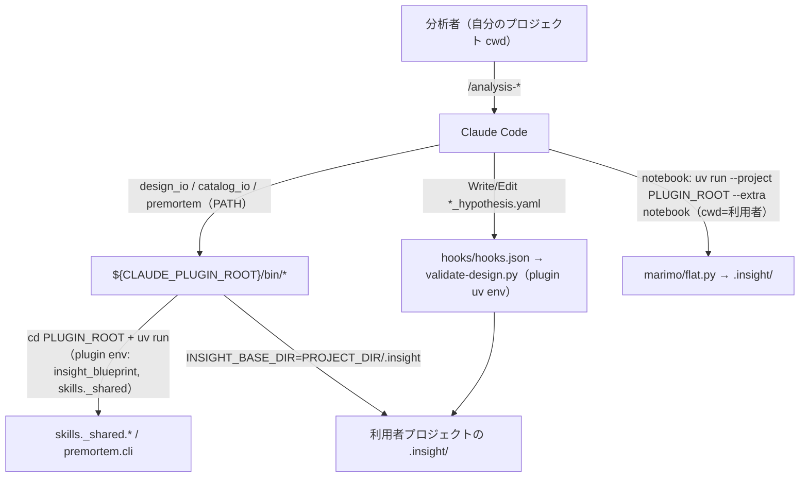
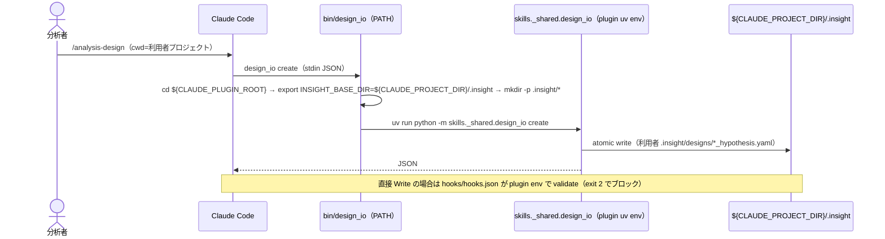

# Epic 09: プラグインを実際にインストール可能にする（execution model 修正）

「既存 `.insight/` があるプロジェクトに install したらどうなる？」の調査で、**この plugin は別プロジェクトに
install すると core が動かない**ことを実機で確認した（利用者 cwd で `ModuleNotFoundError: No module named
'skills'`）。skill コマンドが cwd 前提・`insight_blueprint` 無条件 import・hook が repo 前提で未同梱だったため。
公開済み v0.7.0 の install 経路が壊れている。本 Epic で plugin を**自己完結**させ、install 先で動くようにする。
cross-cutting な実行モデル変更なので [ADR-0006](../adr/0006-plugin-execution-model.md) を伴う。先の A（hook 同梱）+
B（陳腐化 init 案内）を包含。

## Acceptance Criteria

- [x] AC1: `design_io`/`catalog_io` の base-dir を `INSIGHT_BASE_DIR` env 対応（`--base-dir` 後方互換維持）
- [x] AC2: `bin/design_io`/`bin/catalog_io`/`bin/premortem` ラッパー（`cd ${CLAUDE_PLUGIN_ROOT}` + plugin uv 環境 +
  `INSIGHT_BASE_DIR=${CLAUDE_PROJECT_DIR}/.insight` + `.insight` 自動作成）
- [x] AC3: 全 SKILL のコマンドを wrapper 名（`design_io`/`catalog_io`/`premortem`）に統一（素の `python -m skills._shared` 廃止）
- [x] AC4: notebook 実行を `uv run --project ${CLAUDE_PLUGIN_ROOT} --extra notebook`（cwd=利用者、env=plugin）に
- [x] AC5: 検証 hook を plugin 同梱（`hooks/hooks.json` + `hooks/validate-design.py` 移設）。利用者プロジェクトに効く
- [x] AC6: [ADR-0006](../adr/0006-plugin-execution-model.md) + README/CLAUDE/ARCHITECTURE の hook・依存記述更新、
  framing の陳腐化 init 案内を廃止
- [x] AC7: `pytest` 全緑（INSIGHT_BASE_DIR unit 追加 + hook パス更新）、installed 形の simulate 検証。
  最終 E2E（実 /plugin install）はユーザー操作。マージ後 0.7.1 patch release

## Glossary

| Term | Meaning |
|---|---|
| `${CLAUDE_PLUGIN_ROOT}` | plugin の install ディレクトリ絶対パス（Claude Code が実行時に付与） |
| `${CLAUDE_PROJECT_DIR}` | 利用者プロジェクトのルート |
| bin ラッパー | plugin の `bin/`（有効時 PATH に載る）に置く実行スクリプト。cwd/env/依存を吸収 |
| self-provide | plugin 自身の uv 環境が `insight_blueprint`/`skills._shared` を供給し利用者 install 不要にすること |

## Scope

- **範囲内**: env 対応（コア小改修）、bin ラッパー、SKILL コマンド一括書換、notebook 実行形、hook 同梱、
  docs/ADR、framing init 廃止。
- **範囲外**: `insight_blueprint` のロジック変更（env 追加のみ）、premortem の report-only 実装、新機能。

## Architecture

## Module Responsibilities

| モジュール | 責務（する） | 境界（しない） |
|---|---|---|
| `bin/design_io`・`catalog_io`・`premortem` | cwd を plugin へ、env（INSIGHT_BASE_DIR / UV_PROJECT_ENVIRONMENT）を設定、`.insight` 作成、module 実行 | ビジネスロジックは持たない → `skills._shared` |
| `skills/_shared/*`（既存 + env） | YAML I/O・検証。`INSIGHT_BASE_DIR` 既定を尊重 | パス解決の cwd 前提を持たない（wrapper が吸収） |
| `hooks/hooks.json` + `hooks/validate-design.py` | plugin 同梱の PreToolUse 検証（plugin uv env） | 利用者 env への install を要求しない |
| SKILL 群 | wrapper 名でコマンドを記述 | 素の `python -m skills._shared` を書かない |
| `.claude/settings.json`（dev） | この repo 開発時に同スクリプトを配線 | 配布物ではない |

## Sequence Diagram

## Data Model

新規モデルなし。`INSIGHT_BASE_DIR`（env、既定 `.insight`）を追加。生成物の配置は従来どおり
利用者プロジェクトの `.insight/`。

## Decisions

### Cross-epic decisions (links to ADR)
- [ADR-0006](../adr/0006-plugin-execution-model.md) — bin ラッパー + `${CLAUDE_PLUGIN_ROOT}`/`${CLAUDE_PROJECT_DIR}`/
  `INSIGHT_BASE_DIR` で plugin を自己完結させ、install 先で動くようにする。hook も plugin 同梱。

## Test Design Matrix

| Story \ Layer | Unit | Integration | E2E |
|---|---|---|---|
| Story 9.1 env + bin + hook 同梱 + SKILL 書換 | ✓ (`INSIGHT_BASE_DIR`: design_io + catalog_io / premortem config 解決 / hook fail-closed / `test_validate_hook` パス) | ✓ (`test_bin_wrappers.py`: wrapper が foreign cwd から `${CLAUDE_PROJECT_DIR}/.insight` に書き・PLUGIN_ROOT 無しで loud fail / notebook contract) | ✓（committed bin wrapper 統合テストが installed-form の seam を担保）／実 `/plugin install` はユーザー操作 |

完了時に ✓。**Epic 09 team-review（PR #39）を受けて修正済み**: premortem CLI の config 解決を `INSIGHT_BASE_DIR`/`--base-dir` 対応（旧: 相対ハードコードで plugin root 側を誤参照）、hook を design 文書について fail-closed 化、bin wrapper 統合テスト新設。最終 E2E（bin-on-PATH の実挙動）は実 install でのみ最終確定＝ユーザー操作。当初マトリクスは `test_skill_structure`/notebook contract を AC3/AC4 の証跡と誤記していたが、実カバレッジ（`test_bin_wrappers.py`）に置換した。

## Story Timeline

- 2026-07-03 — Epic 09 起票（#38）: main から epic/9-installable-plugin。ADR-0006 + Design Doc。
- 2026-07-03 — Story 9.1 完了: env 対応、bin/ ラッパー3種、全 SKILL コマンド書換、notebook 実行形、hook 同梱
  （hooks/hooks.json + 移設）、docs/ADR、framing init 廃止。installed 形を simulate 検証。pytest 全緑。
  → マージ後 0.7.1 patch release。
- 2026-07-04 — team-review（PR #39）修正: premortem CLI を `INSIGHT_BASE_DIR`/`--base-dir` 対応（blocker）、
  hook を design 文書 fail-closed 化、`test_bin_wrappers.py` + catalog_io/premortem env テスト新設、
  typecheck パスを `hooks/` に更新＋空 `.claude/hooks/` 削除、README 依存ストーリー精緻化。pytest 375 全緑。
