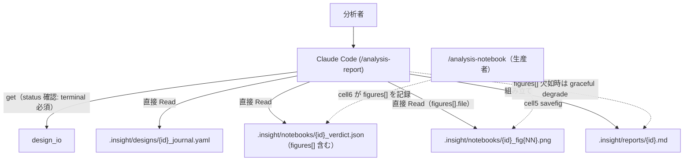
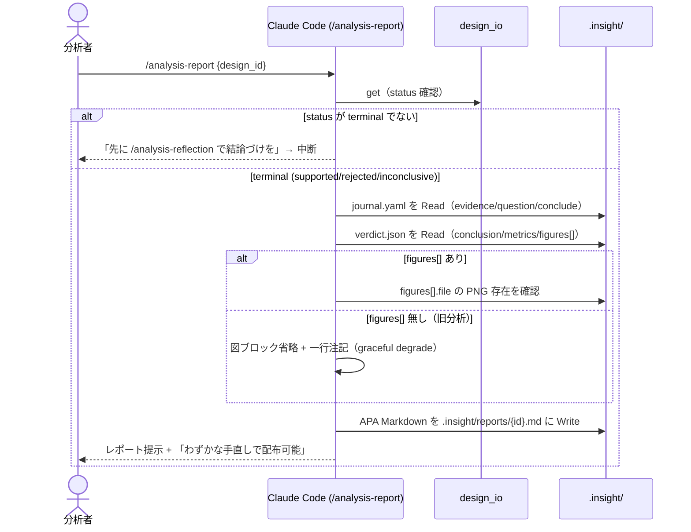

# Epic 10: /analysis-report — APA風レポート生成スキル

分析パイプライン（framing → … → notebook → journal → reflection）の成果は notebook と journal に
分散し、ユーザー本人は把握できても**周囲への説明・配布がしにくい**。本 Epic で `/analysis-report`
を新設し、reflection が結論づけ（`conclude` + terminal status）した design を入力に、design / journal /
verdict / figures を1本の Markdown レポート（`.insight/reports/{id}.md`）に畳む。見出しは英語 APA 標準、
図は notebook 側（生産者）が PNG を切り出し、report（消費者）は組み立てに専念する。

## Acceptance Criteria

- [ ] AC1: `skills/analysis-report/SKILL.md` + `references/apa-template.md` 新設。terminal status の
  design を入力に、design/journal/verdict/figures を集約し `.insight/reports/{id}.md` を生成。英語 APA
  見出し（Abstract / Introduction / Method / Results / Discussion→Limitations/Future Directions / References）
- [ ] AC2: 各 Figure に「軸の説明（Axes）」と「図の読み方（How to read）」を必須キャプションとして付与
- [ ] AC3: notebook 契約(8-cell)拡張。viz cell(5) が `.insight/notebooks/{id}_fig{NN:02d}.png` を保存し、
  verdict cell(6) が `verdict.json` に `figures[]{file,title,axes,how_to_read}` を記録。`notebook-contract.md`
  と `tests/integration/fixtures/sample_notebook.py` 更新
- [ ] AC4: design_io(get) / journal / verdict.json を再利用。report は**読み取り専用**（design 無変更）。
  コア（design_io/validate/models）は無変更
- [ ] AC5: chaining 対称配線（reflection→report）+ CLAUDE.md §6 Skills 表 + `analysis-auto` パイプライン
  末尾統合（report 生成は KEEP ゲート）
- [ ] AC6: ADR-0008（notebook 公開契約への figures[] 追加）+ pytest 全緑 + report 生成の E2E 目視確認

## Glossary

| Term | Meaning |
|---|---|
| APA風レポート | IMRaD 構造 + 英語 APA 標準見出し。厳密体裁（running head / in-text citation）は採らない軽量版 |
| figures manifest | verdict.json に追加する `figures[]` 配列。図の file / title / axes / how_to_read を生産者(notebook)が記録 |
| graceful degrade | 図(PNG/figures[])が無い既存分析でも、レポートを図ブロック省略 + 一行注記で生成続行する挙動 |
| terminal status | `supported` / `rejected` / `inconclusive`。reflection が conclude と同時に遷移する最終状態 |

## Scope

- **範囲内**: 新 skill `/analysis-report` + `references/apa-template.md`、notebook 契約への figures 拡張
  （cell5 PNG保存 + cell6 figures[] 記録）、reflection→report の chaining 配線、`analysis-auto` 末尾ゲート、
  docs（CLAUDE §6 / ARCHITECTURE）、ADR-0008。
- **範囲外**: docx / PDF 変換（別工程・ユーザー判断）。厳密 APA 体裁（running head / in-text citation /
  ハンギングインデント Reference list）。design_io / validate / models の変更。図の内容そのものの生成
  （notebook の領分）。

## Architecture

生産者/消費者の分離: notebook が図(PNG)とマニフェスト(verdict.figures[])を生産し、report は
それを消費して組み立てるだけ。report は notebook を再実行しない（副作用ゼロの読み取り専用）。

## Module Responsibilities

| モジュール / 関数 | 責務（する） | 境界（しない → 委譲先） |
|---|---|---|
| skill `/analysis-report` | terminal design を入力に design/journal/verdict/figures を集約し APA Markdown を組み立て `.insight/reports/{id}.md` に書く。図のキャプションは verdict.figures[] を転記 | 図の生成・図メタの生成はしない → /analysis-notebook。結論づけ → /analysis-reflection。design 変更 → /analysis-design。docx/PDF 化はしない（範囲外） |
| `references/apa-template.md` | APA 見出し骨格・図の提示フォーマット（Axes/How to read 必須）・入力→節の写像の正本 | — |
| skill `/analysis-notebook`（拡張） | cell5 が PNG を `{id}_fig{NN:02d}.png` 保存、cell6 が verdict.json に figures[] を記録 | レポート組み立てはしない → /analysis-report |
| `references/notebook-contract.md`（拡張） | 8-cell 契約に figures[] スキーマ + PNG 保存規約を追記 | — |
| skill `/analysis-auto`（拡張） | reflection 後に report 生成を KEEP ゲートとして提示 | report 本体は再実装しない → /analysis-report に委譲 |
| `design_io`（既存） | get / status 参照 | 変更なし（新 CLI は足さない）。report は書き込まない |

## Sequence Diagram

図はレポートから相対パス（`../notebooks/{id}_fig{NN}.png`）で参照する。report は PNG を移動・複製しない。

## Data Model

新規 Pydantic モデルなし（report は読み取り専用、検証対象の設計書を書かない）。

**verdict.json の拡張**（notebook が書く。schema 検証なしのスキル管理 JSON）:

| Field | Type | Purpose | Example |
|---|---|---|---|
| `figures` | `list[dict]` | 図のマニフェスト（生産者が記録） | 下記 |
| `figures[].file` | `str` | PNG の相対パス基準ファイル名 | `"FP-H01_fig01.png"` |
| `figures[].title` | `str` | 図タイトル | `"施策前後の売上推移"` |
| `figures[].axes` | `str` | 軸の説明（単位付き） | `"横軸=年月, 縦軸=売上(円)"` |
| `figures[].how_to_read` | `str` | 図の読み方 | `"施策投入月の前後で水準の段差に注目"` |

生成物: `.insight/reports/{id}.md`、`.insight/notebooks/{id}_fig{NN:02d}.png`（複数可）。

## Decisions

### Decision: report-is-read-only-consumer

- **What**: `/analysis-report` は design/journal/verdict/figures を読むだけの純消費者。notebook を
  再実行せず、design も書き換えない。図が無い既存分析には graceful degrade（省略 + 注記）。
- **Why**: 生産（notebook）と組み立て（report）の分離（Unix パイプ哲学）。report を実行の副作用から
  切り離すと、冪等・低リスク・テスト容易になる。
- **Affected modules**: `/analysis-report`, `references/apa-template.md`
- **Alternatives considered**: report が notebook を再実行して図を得る → package env / コスト / 副作用を
  report が背負い、生産と組み立てが混ざるため却下。
- **Consequences**: 旧分析の図はレポートに載らない（notebook 再実行が必要）。graceful degrade で吸収。

### Decision: terminal-status-precondition

- **What**: report 生成は terminal status（supported/rejected/inconclusive）を必須とする。非 terminal
  なら「先に /analysis-reflection を」と促して中断。
- **Why**: Abstract = 結論、Discussion = 限界。conclude イベントが無いと中核が空洞になる。`git tag` が
  commit を要求するのと同じで、レポートは「結論づいた分析」に対して出す。
- **Affected modules**: `/analysis-report`（Step: status ガード）
- **Alternatives considered**: analyzing でもドラフト生成可 → 分岐が増え中身が薄いレポートを許すため v1
  では却下（YAGNI）。
- **Consequences**: 中間ドラフトは出せない。必要になれば別途拡張。

### Decision: auto-integration-as-keep-gate

- **What**: `/analysis-auto` は reflection の結論づけ後、report 生成を **KEEP ゲート**として提示（AUTO で
  自動生成しない）。
- **Why**: 配布物はユーザーが手直しする前提の成果。生成の是非は「今これを配布形に固めるか」という
  genuine な判断であり、KEEP 列（ADR-0005 の思想）に属す。
- **Affected modules**: `/analysis-auto`（gate policy の末尾行）
- **Consequences**: auto のパイプライン末尾が reflection → (KEEP) report に伸びる。

### Cross-epic decisions (links to ADR)

- [ADR-0008: notebook 図マニフェスト（verdict.figures[]）で生産者が図の真実を持つ](../adr/0008-notebook-figure-manifest.md)
  — 図の軸・読み方を design.chart（計画）から再構成せず、生産者(notebook)が verdict.json に記録する契約変更。

## Test Design Matrix

| Story \ Layer | Unit | Integration | E2E |
|---|---|---|---|
| Story 10.1 notebook契約拡張（PNG + figures[]） | ✓ (notebook-contract.md 更新: cell5/6 責務 + figures schema) | ✓ (test_analysis_notebook_contract::test_notebook_contract_figures_manifest: figures[] 記録 + PNG 生成) | ✓ (同上: sample_notebook → export script → 実行 → fig PNG / verdict.figures[]) |
| Story 10.2 report skill + apa-template | ✓ (test_skill_structure: 必須節 + 双方向 chaining、test_plugin_structure: exist/frontmatter/version) | ✓ (apa-template.md: 入力→節 写像 + graceful degrade を正本化) | — (Claude-native 組み立て; 実データ E2E は手動確認、下記 Verification) |
| Story 10.3 wiring（reflection chaining / auto / docs） | ✓ (bidirectional_consistency pass、ALL_SKILLS +analysis-report) | — | — |

完了時に ✓。pytest 全緑が Epic PR レビューゲート（387 passed / lint / typecheck 緑）。report 本体は
Claude-native な SKILL.md 指示のため、組み立ての E2E は実データでの手動目視確認で裏付ける。

## Story Timeline

- 2026-07-08 — Epic 10 起票（#47）: main から epic/47-analysis-report を切り、Design Doc 作成。
  development-partner で問題構造化 → design-partner で6論点決着（figures manifest / graceful degrade /
  terminal 必須 / auto KEEP ゲート / ADR-0008）。
- 2026-07-08 — Story 10.1/10.2/10.3 完了（TDD）: notebook 契約を figures[] + PNG に拡張
  （contract doc + fixture + integration test）、`/analysis-report` + `references/apa-template.md` 新設、
  reflection/auto の chaining 配線 + auto KEEP ゲート + CLAUDE §6 + ARCHITECTURE 更新。pytest 387 passed、
  lint / typecheck 緑。実データ E2E（happy-path + graceful-degrade）確認。
- 2026-07-08 — team-review 対応: verdict に `metrics` を永続化（consumer の Results 表が空になる不整合を修正）、
  `figures[].file` の basename 制約（配布物のパストラバーサル防止）、生産者 notebook SKILL の cell5/6 要約更新、
  report プロースの構造テスト新設（`tests/skills/test_analysis_report_structure.py`）、graceful-degrade 文言整合、
  配布物 sensitive-data 注意 + キャプション plain-text 扱い、ARCHITECTURE sequence 図に report 段追加。pytest 393 passed。
- 2026-07-08 — PR #48 レビュー対応: README（Quick Start / Skills 一覧 / Workflow 図 / autopilot 説明）に
  `/analysis-report` を追記、ARCHITECTURE の **analysis-auto 詳細シーケンス図**に terminal 後の report
  KEEP ゲートを追加（実装 step 8 と整合）。
