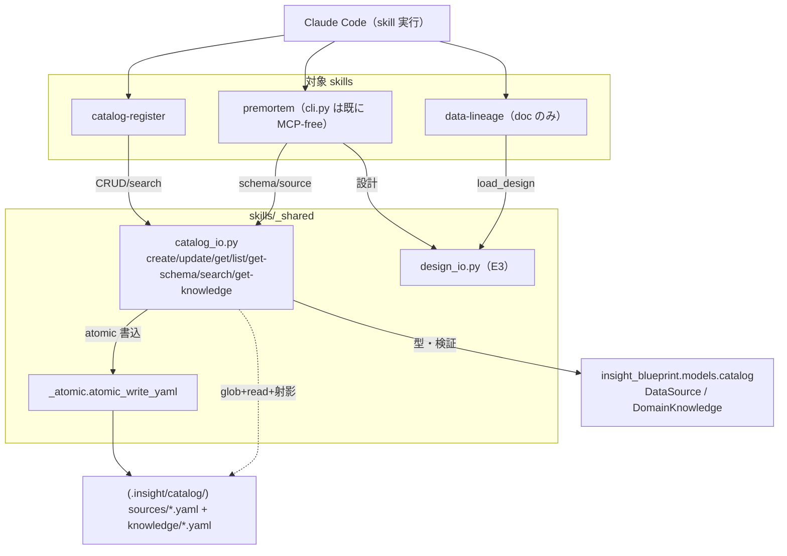
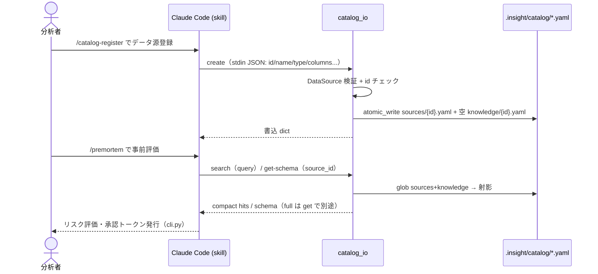

# Epic 3.5: 残り skill を YAML 直接 I/O へ + batch-analysis 撤去

/ ADR-0001 / [ADR-0003](../adr/0003-skill-yaml-io-via-design-io.md) で挿入した E3.5。E3 の design_io に続き、
catalog / premortem / data-lineage の MCP 依存を除き、E4（サーバ削除）の前提「全 skill が MCP-free」を成立させる。
併せて E5 予定だった batch-analysis 撤去を前倒しする。

## Acceptance Criteria

- [x] AC1: `skills/_shared/catalog_io.py` が catalog CRUD（create/update/get/list/get-schema）と
  source+knowledge 横断 search を純 Python で提供（server / sqlite 非依存、書込前に DataSource 検証）
- [x] AC2: catalog-register / premortem / data-lineage の SKILL.md が MCP tool でなく catalog_io / design_io を使う
- [x] AC3: `skills/batch-analysis/` が撤去され、参照（他 skill / docs）も掃除される
- [x] AC4: 全 skill の MCP 設計/カタログ CRUD 参照がゼロ（grep 確認）→ E4 の前提成立
- [x] AC5: `tests/test_catalog_io.py` が全緑（18件）。既存 server/catalog テストは緑のまま（945 passed）

## Glossary

| Term | Meaning |
|---|---|
| catalog_io | `skills/_shared/catalog_io.py`。catalog sources/knowledge の YAML 直接 I/O + file ベース検索 |
| compact hit | search が返す最小要約（doc_type/id/name/tags/snippet 等）。full は get で on-demand |
| batch-analysis | 旧バッチ実行 skill。Claude Code auto mode に置換され撤去（元 E5、本 Epic で前倒し） |

## Scope

[ARCHITECTURE.md](../ARCHITECTURE.md) の残る MCP 依存コンポーネント（catalog / premortem / lineage）を server-free 化し、
[PRD.md](../PRD.md) の「catalog 登録・検索」「データ加工の透明性」を server なしで満たす。

- **範囲内**: catalog_io 新設、catalog-register / premortem / data-lineage の MCP 除去、batch-analysis 撤去、
  ロードマップ更新。
- **範囲外**: MCPサーバ / CatalogService / sqlite_store の削除（**E4**）、premortem 自立化・catalog 柔軟化・
  knowledge 抽出強化（**E5**）。
- **依存**: E3 の design_io を import するため **E3 が先**。E3.5 完了で E4 が実行可能になる。

## Architecture

catalog_io は sqlite/FTS5 を使わない。検索は sources と knowledge を glob→射影→substring マッチし compact hit を返す。

## Module Responsibilities

各モジュールの「責務（する）」と「境界（しない・どこへ委譲するか）」。catalog_io は design_io と同様
**I/O とオーケストレーション**に徹し、モデル検証は `models.catalog`、原子書込は `_atomic`、設計書 I/O は
`design_io` に委譲する（catalog YAML に pre-write hook は無いため、検証は catalog_io がモデル構築で行う）。

| モジュール / 関数 | 責務（する） | 境界（しない → 委譲先） |
|---|---|---|
| `catalog_io.create_source` | id 検証・重複チェック・`sources/{id}.yaml` + 空 `knowledge/{id}.yaml` を書込 | スキーマ妥当性は `DataSource` モデル、原子書込は `_atomic.atomic_write_yaml` |
| `catalog_io.update_source` | 既存読込→merge→`updated_at`→書込 | 妥当性は `DataSource` モデル（再構築で検証） |
| `catalog_io.get_schema` | `schema_info.columns` を返す | 列定義の妥当性は `ColumnSchema` モデル |
| `catalog_io.search` | sources + knowledge を glob→射影→substring マッチ、compact hit を出現回数で粗ランク（type/tags フィルタ） | 全文検索エンジン相当はしない（FTS5 不使用）。full 取得は `load_source`/`get_knowledge` |
| `catalog_io.load_source` / `list_sources` / `load_knowledge` / `get_knowledge` | catalog YAML の read | 書込・検証はしない（読取専用） |
| `catalog_io` CLI | skill 起動口（stdin JSON → 関数 → stdout JSON） | ロジックを持たない（各関数へ委譲）・対話しない |
| `catalog-register` SKILL.md | ユーザー対話・スキーマ探索・catalog_io 呼出 | YAML 直接組立/検証はしない → catalog_io |
| `premortem` SKILL.md | 設計/カタログ情報の収集（→ cli.py へ pipe） | 設計取得は `design_io`、source 情報は `catalog_io`。cli.py 自体は不変 |
| `data-lineage` SKILL.md | 対象設計の確認 → tracked_pipe/export の案内 | 設計取得は `design_io.load_design`。lineage 本体は `insight_blueprint.lineage`（MCP-free） |
| （他 Epic 領分）`design_io`（E3） | 設計書ライフサイクルの I/O | 本 Epic では import して再利用（premortem/lineage が使う） |

## Sequence Diagram

catalog 登録〜premortem での参照の代表フロー。

## Data Model

新規スキーマ無し。既存 `DataSource` / `DomainKnowledge` / `ColumnSchema`（`models/catalog.py`）を再利用。
search の返りは compact dict（full ではない）。

## Decisions

### Decision: catalog-search-glob-projection

- **What**: catalog 検索は FTS5 を使わず glob+射影の file ベース。search は compact hit のみ返し full は get で on-demand。
- **Why**: 消費者が Claude Code になり、CLI 境界で subprocess が重い読みを吸収→Claude のトークン/セッションを節約。
  50–200 ソース規模で線形走査は十分速く、FTS5 はオーバースペック。memory の目次→個別ファイルと同じ構図。
- **Consequences**: BM25 ランキング/trigram は失う（出現回数の粗ランクで代替）。大規模化時は索引を後付け可（skill 契約不変）。

### Decision: batch-analysis-removed-early

- **What**: batch-analysis skill を E5 でなく本 Epic で撤去。撤去範囲は skill 本体 + launcher + batch-prompt +
  `tests/integration/test_batch_launcher.py` + `tests/batch-analysis/fixtures/`。`skills/_shared/*`・`skills/premortem/*`・
  `tests/batch_harness/*` は premortem がまだ使うため**温存**。
- **Why**: E4（サーバ削除）は全 skill の MCP-free が前提。死ぬ予定の skill に変換工数をかけず撤去する方が安い。
- **Consequences**: premortem の「batch 実行ゲート」機能が宙に浮く。premortem 自立化（run 履歴・token の再定義）は E5 に残す。

### Cross-epic decisions (links to ADR)

- [ADR-0001](../adr/0001-drop-mcp-server-embed-validation.md) / [ADR-0003](../adr/0003-skill-yaml-io-via-design-io.md)

## Test Design Matrix

| Story \ Layer | Unit | Integration | E2E |
|---|---|---|---|
| Story 3.5.1 catalog_io | ✓ (test_catalog_io 18) | ✓ (CLI subprocess) | ✓ (create→search→get) |
| Story 3.5.2 skills | — | — | ✓ (CLI 経路で確認) |
| Story 3.5.3 batch 撤去 | — | ✓ (pytest 945 緑) | — |

完了時に ✓。pytest 全緑が Epic PR レビューゲート。

## Story Timeline

- 2026-07-01 — Epic 3.5 起票: epic/3 から epic/3.5-remaining-yaml-io を切り、Design Doc 作成。
- 2026-07-01 — Story 3.5.1 完了: catalog_io.py（CRUD/get-schema/knowledge/search/CLI）+ test 18件。
- 2026-07-01 — Story 3.5.2 完了: catalog-register/premortem/data-lineage を catalog_io/design_io へ。
- 2026-07-01 — Story 3.5.3 完了: batch-analysis 撤去（skill + launcher test + fixtures + e2e runners）。
  premortem/README/CLAUDE.md/ロードマップから batch 参照除去。全 skill が MCP-free に。

## 残存デバット（E4/E5 で掃除）

- `tests/e2e/`（stub_claude 以外の batch fixtures/assertions/expected）は batch e2e の名残。
  stub は integration が共有するため一括削除せず温存。
- `.insight/config.example.yaml` / `package_allowlist.yaml` の batch 系設定コメント。
- README の WebUI / Team Server Mode / `--no-browser` 記述（E1 由来の陳腐化）。
- premortem cli.py の run 履歴・token 依存（batch 前提）の自立化は E5。
